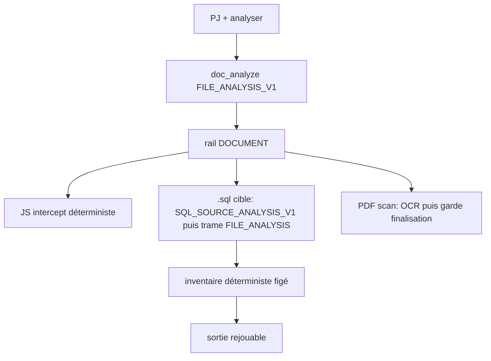

# Lot — SQL_SOURCE_ANALYSIS + finalisation PDF/OCR

## Hors périmètre (gelé)

- Pas de nouvelle tâche PJ. `doc_analyze` + `FILE_ANALYSIS_V1` restent le contrat.
- Pas de changement du routage DOCUMENT validé (`wantsAnalysis`, `shouldBypass`, SC, OCR requis).
- Pas de retouche JS / HTML documentaire / PDF texte intact, sauf si un test de régression casse.
- Pas d’entrée `intentContractRegistry`, pas de consume JUST.

## Diagnostic déjà posé



- [`DOC_EXT_RE`](server/src/agent/policies/attachment/attachmentTaskPolicy.js) ignore `.sql` → `fileKind=none`. L’analyse n’est pas bloquée (le nom suffit), mais le kind est faux.
- [`FILE_ANALYSIS_SOURCE_EXT_RE`](server/src/agent/policies/attachment/fileAnalysisContract.js) ignore `.sql` → pas d’intercept, chute dans [`documentAnalysis`](citadelle-vault/Citadelle/01-Architecture/03-Forge/document-analysis.js) (LLM, 10k de contexte, stream live).
- PDF : OCR et rail OK ; le LLM streame avant tout contrôle. Une réponse coupée reste `pipelinePath=DOCUMENT` + implicitement « OK ».

## A. SQL — choix A figé (comme `.js`)

Chaîne obligatoire :

```
.sql + demande d'analyse
→ doc_analyze
→ FILE_ANALYSIS_V1
→ SQL_SOURCE_ANALYSIS_V1
→ inventaire déterministe
→ trame FILE_ANALYSIS
```

`documentAnalysis` LLM **n'est pas** la source de l'inventaire. Même schéma que le `.js` : `shouldApplyFileAnalysisSourceRail` → `analyzeSourceFileContent` → `formatFileAnalysisReply` → livraison. Pas de chute vers le LLM DOCUMENT pour un `.sql` lisible.

1. **Kind** : ajouter `.sql` à `DOC_EXT_RE` seulement. Résultat : `fileKind=document`, tâche `doc_analyze`. Pas `code`.
2. **Rail source** : ajouter `.sql` à `FILE_ANALYSIS_SOURCE_EXT_RE`.
3. **Analyseur** [`server/src/agent/analysis/analyzers/sqlAnalyzer.js`](server/src/agent/analysis/analyzers/sqlAnalyzer.js) + dispatch dans [`analyzers/index.js`](server/src/agent/analysis/analyzers/index.js).
   - Contrat interne `SQL_SOURCE_ANALYSIS_V1` (`sourceKind=sql`, `analyzer=sql`).
   - Sortie parseur minimale, faits visibles seulement :
     - dialecte/version si commenté (phpMyAdmin / MySQL…)
     - tables
     - colonnes / types
     - PK explicites
     - FK explicites (`FOREIGN KEY` / `REFERENCES` seulement)
     - contraintes / index
     - vues / triggers / procédures / événements
     - présence / volume des `INSERT`
     - anomalies d'encodage ou de dump
     - limites de couverture
   - **Règle dure** : nom de colonne ≠ FK ; nom de table ≠ rôle métier prouvé ; relation probable ≠ relation explicite.
   - Si un `UserId` existe sans `REFERENCES` : `hypothèse à vérifier ; aucune contrainte REFERENCES visible`. Jamais « clé étrangère ».
4. **Livraison** : trame `FILE_ANALYSIS_V1` + bloc **Inventaire SQL** généré uniquement depuis l'objet inventaire. Même en `simple`. Sortie **stable et rejouable** (même dump → même inventaire).
5. **LLM** : hors chemin principal. Une reformulation éventuelle (hors lot, ou addon strict) ne peut que styliser le texte déjà produit. Elle **ne peut pas** ajouter table, colonne, PK, FK, index ou rôle métier absent de l'inventaire. Ce lot livre l'intercept déterministe ; pas de 2e passe LLM requise pour fermer.
6. **Critique SQL** : étendre [`evaluateFileAnalysisSufficiency`](server/src/agent/policies/attachment/fileAnalysisContract.js) :
   - `attachment_used`, `factual_anchoring`, `source_inventory_sufficient`
   - `inferred_claims_marked` : refuser « clé étrangère » / « relation confirmée » sans `REFERENCES` visible
   - pas de `ok` si tables/colonnes absentes alors que le dump en contient
   - 0 hallucination structurelle = critère de fermeture

Point pipeline : le `if (shouldApplyFileAnalysisSourceRail)` déjà présent dans [`agentPipeline.js`](server/src/agent/agentPipeline.js) (~2815) suffit. Pas de nouveau `if` de routage. Un `.sql` ingéré ne doit plus atteindre `documentAnalysis`.

## B. PDF/OCR — finalisation avant livraison

OCR, décision `PDF_SCANNED_NO_TEXT`, et `pipelinePath=DOCUMENT` restent.

1. Nouveau module [`server/src/agent/policies/document/documentFinalizationGuard.js`](server/src/agent/policies/document/documentFinalizationGuard.js) :
   - mesures : `sections_expected`, `sections_completed`, `repetition_detected`, `truncation_detected`, `finalization_status` (`complete` | `partial_explicit` | `rejected_incomplete`)
   - détecter paragraphes/titres répétés (≥3 fois la même section)
   - phrase coupée (pas de `.!?` / fin de heading en queue)
   - si budget insuffisant : collapser les répétitions, couper à la dernière phrase complète, **réduire** à une synthèse courte + limites (pas relancer un 2e LLM)
   - si arrêt inévitable : marqueur explicite `Analyse partielle — génération interrompue.` + `finalization_status=partial_explicit`
2. **Buffer, ne pas streamer** le LLM sur ce chemin FILE_ANALYSIS+PDF : appeler `documentAnalysis(..., { onContent: null })` puis garde puis un seul `onContent` du texte final. Sinon l’utilisateur voit encore la boucle. Ce n’est pas un changement de rail.
3. **Critique PDF** : refuser coupure, répétition, ou absence de `finalization_status`. `Agent Critique : OK` seulement si `repetition_absent` + `final_output_complete` (complete **ou** partial_explicit). Un DOCUMENT qui a simplement tourné ≠ OK.
4. Ne pas traiter une sortie tronquée comme `complete`.

## Critique unifiée (checks demandés)

Sur les deux chemins FILE_ANALYSIS concernés, journaliser / évaluer :

- `attachment_used`
- `factual_anchoring`
- `source_inventory_sufficient` (SQL ; N/A documenté pour PDF)
- `inferred_claims_marked` (SQL)
- `repetition_absent`
- `final_output_complete`

Réparer SQL par reformat déterministe de l’inventaire (jamais un LLM). Réparer PDF par la garde (collapse + marqueur), pas un retry LLM.

## Tests

- **SQL** : dump minimal type MonCoach (`achievements`, `coursecomments` avec `UserId`/`CourseId` **sans** `REFERENCES`) → inventaire tables/colonnes/PK ; **aucune** FK affirmée ; `sourceKind=sql` ; `fileKind=document` ; `shouldApplyFileAnalysisSourceRail=true` ; pas d’appel `documentAnalysis` ; critique OK. Deuxième fixture **avec** `REFERENCES` → FK listée comme fait. Même dump rejoué deux fois → inventaire identique.
- **PDF finalisation** : texte répétitif « Base utilisateur » + coupure mid-phrase → `repetition_detected`, `truncation_detected`, sortie sans boucle, fin propre, `partial_explicit` ou `complete` après collapse. OCR / `PDF_SCANNED_NO_TEXT` inchangés ([`pdf-text-layer-decision.test.js`](server/tests/pdf-text-layer-decision.test.js)).
- **Régression** : [`file-analysis-contract.test.js`](server/tests/file-analysis-contract.test.js) JS ; HTML `doc_analyze` Freepik ; PDF texte intact. `shouldBypassDocumentAnalysisRoute` / `doc_analyze` inchangés.

## Fermeture

```
SQL = inventaire déterministe, rejouable, 0 hallucination structurelle
PDF OCR = complete ou partial_explicit
DOCUMENT = inchangé
FILE_ANALYSIS_V1 = conservé
documentAnalysis = pas source de l'inventaire SQL
```

Addendum court dans [`docs/agents/file-analysis-contract.md`](docs/agents/file-analysis-contract.md) : `sourceKind=sql` + garde de finalisation PDF. Pas de 3e doctrine.
