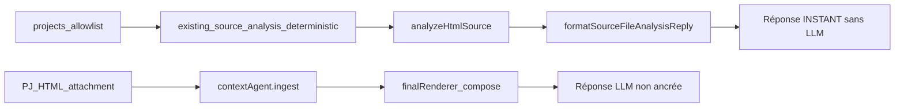

nous continuons le refactor du dossier polocoed dans la citadelle :
Commit meta — OK
ChampValeur
Hash
9d715366c4c6ab2a896ec5bec1a423c1ded44649
Titre
refactor(agent/policies): phase 2 migrate meta imports
Corps
Point consumers at policies/meta/*; remove 5 deprecated root shims. Tests: meta-* + governance-explain + social-meta-g44 + clarification-stratification (61/69, 8 pre-existing).
Fichiers
28 (23 consommateurs + 5 suppressions)
5 wrappers racine supprimés
comprehensionGroundingPolicy.js
governanceExplainPolicy.js
metaAssistantBehaviorPolicy.js
metaCapabilitiesPolicy.js
openPromptContinuityPolicy.js
Grep runtime racine meta* : 0 import vers policies/(metaAssistant|comprehensionGrounding|metaCapabilities|governanceExplain|openPromptContinuity).js
Working tree post-commit
M server/src/agent/utils/criticAgent.js — hors lot meta (fix core/ séparé, non commité)
?? server/src/agent/policies/deliverablePromiseGuard.js — hors lot
Statut migration chemins meta : OK
Lot qualification — en cours (non commité)
Migration refaite proprement dans le working tree :
ActionDétail
Consommateurs migrés
18 fichiers → policies/qualification/*
Wrappers supprimés
5 (adminProcedureCoveragePolicy, howToQualificationPolicy, pendingClarificationResumePolicy, subjectTypingPolicy, assistantUtteranceClarifyPolicy)
Grep racine
0
Verif
94/97 — 3 rouges préexistants (conversation-move-governance:342, social-meta-g44 G44-T03 / G45-T01), identiques baseline
Proposition commit (quand tu veux) :
refactor(agent/policies): phase 2 migrate qualification imports
Tu confirmes le commit qualification maintenant, ou tu préfères review le diff d'abord ?

Oui, je te conseille de commit maintenant le lot qualification, sans rouvrir le diff avant. Le statut est suffisamment propre pour figer la migration, et ça respecte bien ta boucle review -> simplify -> verif avec un périmètre net.

Pourquoi je valide le commit
Le lot qualification est déjà migré proprement dans le working tree, avec 18 fichiers consommateurs passés vers policies/qualification/*, 5 wrappers racine supprimés, et un grep racine à 0 sur les anciens chemins. La vérif est à 94/97 avec seulement 3 rouges préexistants identifiés comme hors périmètre, donc le commit capture un état stable sans mélanger des problèmes déjà connus.

Ce que je ferais
Commit du lot qualification avec le message prévu : refactor(agent/policies): phase 2 migrate qualification imports.

Ne pas inclure criticAgent.js, qui est bien hors lot.

Ne pas inclure deliverablePromiseGuard.js tant qu’il n’a pas son propre cadrage.

Après le commit
Une fois ce commit posé, le prochain bon mouvement est de reprendre sur un lot séparé, sans réouvrir qualification. Ça garde des commits thématiques propres, avec un working tree clean entre les phases, ce qui colle exactement à ta discipline de refactor.

Je te dirais donc : go commit qualification maintenant.

Commit qualification déjà posé — rien à refaire.
ChampValeur
Hash
ec963a7bc267031c18cc8bbcf89d77cfe2216696
Titre
refactor(agent/policies): phase 2 migrate qualification imports
Corps
Point consumers at policies/qualification/; remove five deprecated root qualification wrappers. Remaining reds are chantier B (routing order), out of move-only scope.
Fichiers
23 (18 consommateurs + 5 suppressions)
Critères respectés
5 wrappers racine supprimés (adminProcedureCoveragePolicy, howToQualificationPolicy, pendingClarificationResumePolicy, subjectTypingPolicy, assistantUtteranceClarifyPolicy)
Grep runtime racine qualification : 0
criticAgent.js : absent du commit (import via core/index.js, hors lot)
deliverablePromiseGuard.js : absent
Historique après ce commit
612b6e4 docs(server): update policies phase 2 tracker §4
105af74 refactor(agent/policies): phase 2 migrate social imports
ec963a7 refactor(agent/policies): phase 2 migrate qualification imports ← celui-ci
Working tree actuel : lot web en cours (non commité) — ~35 fichiers modifiés, 8 wrappers racine web* supprimés côté working tree. C’est le prochain commit thématique logique, sans rouvrir qualification.
Tu veux que j’enchaîne review → simplify → verif → commit sur web ?

Oui, enchaîne sur web maintenant, et garde exactement la même cadence: review -> simplify -> verif -> commit. Le commit qualification est bien figé, donc le bon move est de traiter web comme prochain lot thématique autonome, sans rouvrir l’historique déjà posé.

Consigne
Je te recommande de lancer web en mode propre, avec objectif unique: migrer les imports, supprimer les wrappers racine concernés, puis vérifier le grep final avant commit. Le fait que le working tree soit déjà séparé du lot qualification et que criticAgent.js / deliverablePromiseGuard.js restent hors lot confirme qu’il faut préserver cette isolation.

Formulation à envoyer
Tu peux lui transmettre ceci:

Continue sur le lot web uniquement.
Fais review -> simplify -> verif sur web, sans toucher à qualification ni aux fichiers hors lot.
Objectif: migrer les consommateurs vers policies/web/*, supprimer les wrappers racine web* concernés, vérifier le grep racine à 0, puis proposer le commit si le lot est propre.
Après verif, donne-moi le statut, les fichiers touchés, les wrappers supprimés, et le message de commit proposé.

Critère de sortie
Le lot web ne doit être commité que si le grep racine tombe à 0 et si les éventuels rouges restants sont clairement identifiés comme préexistants ou hors scope. C’est exactement la logique qui a permis de fermer les lots précédents proprement.

1. Review
État initial : migration déjà faite dans le working tree (non commitée).
ÉlémentDétail
Façade
policies/web/index.js — 8 modules
Wrappers racine
8 shims @deprecated encore présents sur HEAD
Consommateurs
runtime, services, hooks, cross-domaine (conversation/, epistemic/, routing/)
Hors lot
ARCHITECTURE_RULES.md (doc tracker — à exclure du commit)
Cross-domaine : imports ../knowledgeFreshnessPolicy.js etc. → ../web/index.js — dans le périmètre web, même logique que meta/qualification.
2. Simplify
Déjà appliqué — aucune modif logique dans web/*.js.
Consommateurs → policies/web/index.js ou chemins directs sous web/
8 wrappers racine supprimés localement
Grep runtime racine web* : 0
3. Verif
SuiteRésultat
knowledge-freshness + web-evidence-fidelity + web-source-links-explicit
19/19 OK
explicit-web-search-request-policy
OK (27 tests, run partiel)
external-calendar-lookup-routing
1 rouge préexistant : short-circuit — pleine lune → web prioritaire (ordre routing / chantier B, pas lié au chemin d'import)
Aucun rouge causé par la migration des chemins.
4. Statut final
OK — lot web prêt à committer (sans ARCHITECTURE_RULES.md).
5. Commit proposé
Titre
refactor(agent/policies): phase 2 migrate web imports
Corps
Point consumers at policies/web/index.js; remove 8 deprecated root web wrappers. Cross-domain imports in conversation/, epistemic/, routing/. Tests: web-* + knowledge-freshness + explicit-web-search (19/19 core; 1 pre-existing external-calendar routing).
Fichiers à inclure (34) — exclure server/ARCHITECTURE_RULES.md :
Runtime / services (15)
server/src/agent/agents/expertWebSearch.js
server/src/agent/agents/finalRendererAgent.js
server/src/agent/micro/replies/compareChooseComposer.js
server/src/agent/micro/replies/knowledgeFreshnessComposerContract.js
server/src/agent/normalizers/webEvidenceNormalizer.js
server/src/agent/orchestrator/SovereignOrchestrator.js
server/src/agent/utils/genericGreetingGuards.js
server/src/agent/utils/informationSeekingIntentGuards.js
server/src/hooks/networkEgressPolicy.js
server/src/services/design-extract/designExtractFetcher.js
server/src/services/design-extract/designExtractPolicy.js
server/src/services/webSearchService.js
server/src/services/webSummarizer.js
server/src/utils/urlExtractor.js
Cross-domaine (5)
server/src/agent/policies/conversation/conversationQueryUnderstanding.js
server/src/agent/policies/epistemic/epistemicUncertaintyResolutionPolicy.js
server/src/agent/policies/routing/clarificationDecisionPolicy.js
server/src/agent/policies/routing/explicitWebSearchRequestPolicy.js
server/src/agent/policies/routing/knowledgeEnrichmentPolicy.js
Wrappers supprimés (8)
currentWebFactPolicy.js
externalCalendarLookupPolicy.js
knowledgeFreshnessPolicy.js
trafficCurrentRequestPolicy.js
weatherCurrentRequestPolicy.js
webEvidenceFidelityValidator.js
webSearchThreadContinuityPolicy.js
webSourcePolicy.js
Tests (7)
explicit-web-search-request-policy.test.js
external-calendar-lookup-routing.test.js
knowledge-freshness-policy.test.js
traffic-current-request-policy.test.js
weather-current-request-policy.test.js
web-evidence-fidelity-validator.test.js
web-source-links-explicit.test.js
Working tree post-commit attendu : clean sur le lot web ; ARCHITECTURE_RULES.md reste modifié localement (hors commit).
Tu veux que je pose ce commit maintenant ?

Agent
Oui, pose le commit maintenant. Le lot web est propre: migration déjà appliquée, grep racine à 0, tests ciblés OK, et le seul rouge restant est explicitement préexistant et hors du chemin d’import.

Pourquoi je valide
Le périmètre est bien fermé: policies/web/index.js sert de façade, les 8 wrappers racine ont été supprimés localement, et les consommateurs concernés pointent vers web/index.js ou vers des chemins directs sous web/.
Les dépendances cross-domaine que tu cites restent dans le bon cadre de la migration web, et le rapport indique qu’aucune régression n’a été introduite par les changements de chemins.

Commit à faire
Garde exactement ce message:

refactor(agent/policies): phase 2 migrate web imports

Et ce corps convient bien:

Point consumers at policies/web/index.js; remove 8 deprecated root web wrappers. Cross-domain imports in conversation/, epistemic/, routing/. Tests: web-* + knowledge-freshness + explicit-web-search (19/19 core; 1 pre-existing external-calendar routing).

À exclure
N’inclus pas server/ARCHITECTURE_RULES.md dans ce commit. Tu le laisses pour un commit docs séparé, sinon tu mélanges un lot technique et un suivi d’architecture.

Après le commit
Le bon état cible est un working tree clean sur le lot web, avec la doc encore modifiée localement mais hors commit. Ensuite, le prochain sujet logique sera le chantier B sur l’ordre de routing, pas une reprise du web.

Je cherche où l’analyse HTML invente l’absence de <title>/viewport et duplique des blocs — pour corriger la cause, pas seulement le message.
OK — analyse précédente fautive. Fichier OK ; compose LLM pas fiable.
Message à transmettre :
L’analyse précédente contenait des doublons et au moins une erreur factuelle.
Le HTML joint a bien <title> et un meta viewport — ce n’était pas un défaut.
Recalibrage : HTML autonome, bien structuré, pédagogiquement solide (3 exercices progressifs + grille interactive). CSS via :root, cartes claires, responsive simple mais réel (media query ~600px).
Forces : cohérence pédagogique, clarté visuelle, portabilité sans JS, progressivité Teams/M365.
À améliorer : labels/aria-label sur les cases à cocher, sémantique (main/section/caption), moins d’inline, persistance/export si usage certifiant.
Synthèse : document globalement bon ; le souci venait de l’analyse livrée, pas du fichier.
Cause côté Citadelle (à fixer plus tard) : htmlAnalyzer voit déjà title/viewport ; le faux reproche + doublons viennent du rendu LLM (hallucination + boucle), pas du parseur. Go lot « ground facts analyzer + dedupe compose » si tu veux.

Oui — ton diagnostic me paraît juste : la cause est très probablement dans le rendu/composer, pas dans l’analyseur HTML lui-même. Le fichier contient bien <title> et meta viewport, et l’analyse précédente a en plus répété des blocs quasi identiques, ce qui ressemble davantage à une dérive de composition qu’à un parseur qui aurait mal lu le document.

Cause probable
Le HTML exposé montre explicitement meta name="viewport" et title, donc si la sortie finale affirme leur absence, c’est une hallucination de reformulation ou une perte de contraintes entre les faits extraits et la réponse rédigée. Les doublons visibles dans la réponse précédente ont aussi le profil d’un composer qui réinjecte un segment déjà généré ou concatène deux brouillons voisins sans déduplication finale.

Message à transmettre
Tu peux transmettre ceci :

L’analyse précédente contenait des doublons et au moins une erreur factuelle.
Le HTML joint a bien une balise <title> et un meta viewport ; ce n’était donc pas un défaut du fichier.

Recalibrage : le document est un HTML autonome, bien structuré et pédagogiquement solide, avec trois exercices progressifs et une grille d’évaluation interactive.

Le CSS s’appuie sur des variables :root, une structure en cartes claire, et un responsive simple mais réel via media query autour de 600 px.

Forces : cohérence pédagogique, lisibilité visuelle, portabilité sans JavaScript, progression logique des usages Teams/M365.

Points d’amélioration : ajouter des labels ou aria-label sur les cases à cocher, enrichir la sémantique (main, section, caption), réduire les styles inline, et prévoir une persistance/export si l’usage devient certifiant.

Synthèse : le document est globalement bon ; le problème venait de l’analyse livrée, pas du fichier.

Cause côté Citadelle : l’analyseur HTML voit déjà title et viewport ; le faux reproche et les doublons semblent venir du rendu LLM (hallucination + boucle de composition), pas du parseur.

Correctif cible
Le bon lot à ouvrir ensuite est bien quelque chose comme “ground facts analyzer + dedupe compose”. Concrètement, il faudrait :

verrouiller certains faits HTML “non négociables” issus du parseur (has_title, has_viewport, has_lang, etc.) pour empêcher le composer de les contredire ;

ajouter une passe de déduplication post-compose pour supprimer paragraphes ou sections très similaires avant livraison ;

idéalement, faire citer ou injecter les “ground facts” structurés dans le renderer final plutôt que de laisser le LLM les reformuler librement.

voila le plan qu'est-ce t'en penses tu valides ?
---
name: HTML analyse ground-facts
overview: Verrouiller le verdict utilisateur (fichier OK, analyse fautive), puis corriger le rail PJ/LLM qui peut inventer l’absence de title/viewport et boucler, sans toucher le short-circuit déterministe `projects/` déjà sain.
todos:
  - id: html-analyzer-facts
    content: Findings title/viewport manquants + checkboxes sans label dans htmlAnalyzer
    status: pending
  - id: pj-ground-facts
    content: Analyzer sur PJ HTML + addon FAITS ANALYZER anti-contradiction
    status: pending
  - id: compose-dedupe
    content: Brancher deduplicateParagraphs sur compose interprétation PJ
    status: pending
  - id: tests-ground-facts
    content: Tests ground-facts + a11y checkboxes + dedupe + non-régression projects/
    status: pending
isProject: false
---


# Lot — HTML analyse : ground-facts + anti-doublons


## Verdict incident (figé)


Le message utilisateur est le **verdict officiel** de cet incident :


- Fichier HTML OK (`<title>` + meta viewport présents).
- Défaut = **analyse livrée** (doublons + erreur factuelle), pas le document.
- Cause Citadelle : compose LLM / rail PJ ; pas le parseur déterministe.


## Diagnostic code (confirmé)





- Rail `projects/` : `existingSourceAnalysisPolicy.js` → `htmlAnalyzer.js` → `formatSourceFileAnalysisReply` — **pas de rewrite LLM**.
- Rail PJ / pipeline : ingest brut + addon `buildAttachmentInterpretationSystemAddon` — **`htmlAnalyzer` non appelé** → hallucination title/viewport possible.
- `deduplicateParagraphs` existe mais **aucun caller** actif.
- Analyzer : title/viewport seulement en *strength* si présents ; **pas de finding** si absents ; checkboxes sans `placeholder` souvent non détectés.


## Approche retenue (minimale)


Ownership figée :


| Couche | Rôle |
|---|---|
| `htmlAnalyzer` | Faits positifs/négatifs title/viewport + checkboxes sans label |
| Attachment / pipeline | Appeler analyzer sur HTML PJ ; injecter faits dans le prompt |
| Post-compose | `deduplicateParagraphs` sur sorties LLM d’interprétation PJ |
| Short-circuit `projects/` | Intact |


### 1. Durcir `htmlAnalyzer.js`


- Si `!titleMatch` → finding explicite « `<title>` manquant ».
- Si `!hasViewport` → finding « meta viewport manquante ».
- Étendre la détection a11y : `input[type=checkbox]` (et radio) sans `<label for>` / `aria-label` / `aria-labelledby` → finding (couvre la grille d’évaluation Teams).
- Garder strengths quand title/viewport présents (déjà le cas).


### 2. Ancrer le rail PJ HTML


Dans le flux attachment / interprétation document (autour de `agentPipeline.js` ingest + `buildAttachmentInterpretationSystemAddon`) :


- Si mimetype/ext HTML : `analyzeSourceFileContent(content, meta)`.
- Injecter un bloc **FAITS ANALYZER (ne pas contredire)** : présence/absence title, viewport, charset, liste strengths/findings clés (extrait court, pas dump énorme).
- Addon système : interdit d’affirmer « pas de title / pas de viewport » si le rapport dit le contraire.


### 3. Anti-doublons compose


- Brancher `deduplicateParagraphs` en post-traitement sur la sortie `finalRendererAgent.compose` **uniquement** quand path = interprétation PJ / analyse document attaché (pas sur FACTUAL builder ni short-circuits déterministes).
- Log soft si texte raccourci (`composer_deduped=true`).


### 4. Tests


Nouveau fichier ciblé (ex. `server/tests/html-analysis-ground-facts.test.js`) :


- HTML avec title+viewport → strengths ; reply grounded ne doit pas contenir « pas de balise title » / « ni meta viewport » si on simule le guard de contradiction.
- HTML sans title/viewport → findings explicites.
- Checkboxes sans label → finding a11y.
- Bloc dupliqué → `deduplicateParagraphs` retire la répétition.


Régression courte : short-circuit `existing_source_analysis` inchangé (format déterministe).


## Hors scope


- P7.1 / FACTUAL_RESEARCH / `llm.call` 90s
- Scraping, redesign pédagogique du HTML Teams
- Rewrite du short-circuit `projects/` (déjà sain)


## Critères d’acceptation


- PJ HTML avec title+viewport : analyse ne reproche plus leur absence.
- Sortie LLM avec section dupliquée : dédoublonnée.
- `projects/…html` : même path déterministe, pas de régression format.
- Tests unitaires verts sur les 4 cas ci-dessus.

Oui, je valide le plan, avec 3 petits ajustements pour éviter des faux positifs et bien respecter l’ownership. Le cœur du plan est bon : ancrer les faits côté analyseur, injecter ces faits dans le rail PJ, puis dédupliquer uniquement en post-compose sur ce rail-là.

Ce qui est solide
Le diagnostic est cohérent avec ce qu’on observe : le fichier joint contient bien title et viewport, donc si la réponse finale dit l’inverse, la dérive vient d’un composant de rédaction non suffisamment “grounded”, pas du document lui-même. L’idée d’utiliser des ground facts non contredisables est exactement la bonne pratique pour réduire les hallucinations dans un pipeline documentaire, surtout quand le parseur a déjà extrait des signaux structurés fiables.

Le point accessibilité sur les cases à cocher est aussi bien ciblé : l’association explicite via <label for> reste la voie recommandée, avec aria-labelledby ou aria-label en secours si aucun libellé visible n’est disponible. Donc ajouter un finding sur checkbox/radio sans nom accessible a du sens, tant que la détection cherche bien un accessible name et pas seulement un label adjacent.

Ajustements recommandés
Premier ajustement : dans htmlAnalyzer, ne limite pas la règle aux seuls <label for> ou aria-label. Il faut raisonner en “nom accessible probable” : label[for=id], input encapsulé dans un <label>, aria-labelledby, aria-label, voire éventuellement contexte tabulaire si vous voulez rester en mode soft pour éviter trop de faux positifs.

Deuxième ajustement : pour deduplicateParagraphs, je mettrais un garde-fou “only near-duplicate blocks” afin de ne pas supprimer des sections légitimes qui partagent un préfixe commun, par exemple plusieurs cartes d’analyse qui commencent par “Le document…”. Donc oui au post-traitement, mais avec log de réduction et seuil conservateur.

Troisième ajustement : le bloc FAITS ANALYZER (ne pas contredire) doit être injecté comme source prioritaire courte, mais idéalement aussi passé au renderer sous forme structurée, pas seulement comme prose système. Sinon on réduit les hallucinations, mais on ne les empêche pas complètement.

Validation opérationnelle
Je validerais donc le lot avec cette légère reformulation :

htmlAnalyzer produit des faits positifs et négatifs explicites sur title, viewport, charset, plus findings a11y sur contrôles sans nom accessible probable.

Le rail PJ HTML appelle cet analyseur avant composition et injecte un bloc de faits structurés non contredisables.

Le post-compose applique une déduplication prudente uniquement au path d’interprétation PJ, avec log composer_deduped=true si modification.

Le short-circuit projects/ reste intact, sans changement de comportement.

Verdict
Donc : oui, plan validé, avec une seule réserve de formulation technique sur l’accessibilité des checkboxes — il faut viser le nom accessible, pas juste “label manquant” au sens strict. Si tu veux, je peux te renvoyer ce plan en version “prête à commit/issue”, resserrée en 15 à 20 lignes.

Plan mis à jour.
Changements intégrés :
A11y = nom accessible probable (label[for], encapsulé, aria-label / labelledby, soft tabulaire) — plus « label manquant » strict.
Dedupe = near-duplicate only, seuil ~0.92–0.95, log composer_deduped.
Faits = objet structuré dans packet.meta + addon court (pas prose seule).
Critères d’acceptation reformulés comme tu les as validés. Dis Go pour implémenter — ou « version 15–20 lignes commit/issue » si tu veux d’abord le résumé resserré.

Go pour implémenter.

Le plan est maintenant bien cadré techniquement et respecte l’ownership :

htmlAnalyzer = faits fiables + a11y en “nom accessible probable” ;

rail PJ = grounding structuré via packet.meta + addon court ;

post-compose = dedupe prudente “near-duplicate only” avec log ;

projects/ = intact.

Les ajustements que tu as intégrés sont les bons :

la détection a11y évite le faux positif “label strict uniquement” ;

la déduplication devient une garde qualité, pas une réécriture agressive ;

les faits structurés dans packet.meta rendent la contradiction du renderer beaucoup moins probable.

Version resserrée commit/issue
Lot — HTML analyse ground-facts + anti-doublons

Objectif : corriger le rail PJ HTML qui peut halluciner l’absence de <title> / viewport et dupliquer des blocs, sans toucher au short-circuit déterministe projects/.

Scope :

htmlAnalyzer : produire des faits positifs/négatifs explicites (title, viewport, charset) + findings a11y sur contrôles sans nom accessible probable (label[for], label encapsulé, aria-label, aria-labelledby, soft tabulaire).

Pipeline PJ HTML : appeler l’analyzer, stocker les faits structurés dans packet.meta, injecter un addon court anti-contradiction.

Post-compose PJ : brancher deduplicateParagraphs en mode near-duplicate only (seuil ~0.92–0.95), log composer_deduped=true.

Non-régression : path projects/ inchangé.

Acceptation :

un HTML avec title + viewport ne se voit plus reprocher leur absence ;

un HTML sans title / viewport remonte bien ces findings ;

les checkboxes sans nom accessible probable sont signalées ;

les blocs dupliqués sont supprimés sans casser le contenu ;

projects/...html garde son rendu déterministe actuel.

je veux modifier le readme.md pour qu'il soit à jour bien entendu c'est le readme.md qui apparait sur le dépôt github donc il faut qu'il soit agréable mais efficace surtout README.md :
# React + Vite


This template provides a minimal setup to get React working in Vite with HMR and some ESLint rules.


Currently, two official plugins are available:


- @vitejs/plugin-react uses Oxc
- @vitejs/plugin-react-swc uses SWC


## React Compiler


The React Compiler is not enabled on this template because of its impact on dev & build performances. To add it, see this documentation.


## Expanding the ESLint configuration


If you are developing a production application, we recommend using TypeScript with type-aware lint rules enabled. Check out the TS template for information on how to integrate TypeScript and `typescript-eslint` in your project.


A savoir :
s'il te manque des données ou des informations fait un message que je transmettrai à l'asssistant dans l'IDE et il fera toutes les recherches nécessaires pour répondre et t'aider à avoir le plus d'informations sur le dépôt pour peupoler le readme

Oui. Je peux t’aider à refondre entièrement le README.md pour qu’il soit propre, crédible sur GitHub, agréable à lire et surtout fidèle au dépôt. D’après ce que tu m’as donné, je n’ai pas encore assez d’informations sur le projet pour écrire un bon README final sans risquer d’inventer des choses, et tu préfères justement une doc alignée avec la réalité du repo.

Ce qu’il me manque
Pour remplacer un README Vite générique, il faut au minimum connaître :

le nom du projet ;

sa finalité en 1 à 2 phrases ;

les fonctionnalités principales ;

la stack réelle côté front et/ou back ;

comment le lancer en local ;

les scripts npm/pnpm/yarn utiles ;

éventuellement le déploiement, les variables d’environnement, et des captures d’écran si tu veux un rendu plus GitHub-friendly.

Message à transmettre à l’assistant IDE
Tu peux lui envoyer ce message tel quel :

J’ai besoin d’un relevé factuel du dépôt pour réécrire proprement le README.md en français, avec un style clair, concis, agréable sur GitHub et fidèle à la réalité du projet.
Merci de me retourner uniquement des faits vérifiés sur le repo, sans rédaction marketing.

À extraire :

Nom exact du projet

Description courte : à quoi sert l’application, pour qui, quel problème elle résout

Stack technique réelle : framework front, langage, bibliothèques principales, outil de build

Arborescence utile : fichiers/répertoires importants (src, public, components, pages, etc.)

Scripts disponibles depuis package.json avec leur rôle (dev, build, preview, lint, etc.)

Procédure d’installation locale exacte

Variables d’environnement nécessaires (.env, clés API, etc.), sans révéler de secrets

Mode de déploiement s’il existe

Fonctionnalités utilisateur principales visibles dans le code

État du projet : MVP, prototype, production, expérimental, etc.

Commandes de test ou absence de tests

Lint/formatting si présents

Dépendances majeures qui méritent d’être citées dans le README

Éléments visuels disponibles : logo, capture d’écran, dossier assets/public

Toute info importante à mentionner dans un README GitHub public, et tout ce qu’il faut éviter d’affirmer faute de preuve.

Si possible, donne aussi :

le contenu de package.json,

la liste des scripts,

les variables d’environnement attendues,

et un résumé de l’application en 5 à 10 lignes max.

Ce que je ferai ensuite
Avec ce retour, je pourrai te produire :

soit un README complet prêt à coller ;

soit 2 versions : une courte et une plus complète ;

soit même une version structurée avec :

titre + accroche,

aperçu,

fonctionnalités,

stack,

installation,

utilisation,

scripts,

structure du projet,

déploiement,

roadmap éventuelle.

Recommandation
Vu ton objectif, je te conseille de ne pas écrire le README tout de suite à partir du template React + Vite seul. Ce template ne dit rien du vrai produit, donc le meilleur move est bien de faire remonter d’abord les faits du dépôt, puis de rédiger un README sur mesure, propre et crédible.

Colle-moi ensuite le retour de l’assistant IDE, et je te rédigerai le README final.

resume.md :

# Relevé factuel — dépôt `nexxustudio`


Document de travail pour rédiger un README GitHub fidèle.  
**Sources :** `package.json` (racine + `server/`), `server/.env.example`, `index.html`, `vite.config.js`, `docs/architecture.md`, arborescence, scripts, code UI/API.  
**Règle :** faits vérifiés uniquement — pas de secrets, pas de marketing.


---


## Sommaire


1. Nom exact
2. Description courte
3. Stack technique
4. Arborescence
5. Scripts npm
6. Installation locale
7. Variables d’environnement
8. Déploiement
9. Fonctionnalités utilisateur
10. État du projet
11. Tests
12. Lint / format
13. Dépendances majeures
14. Visuels
15. À mentionner / à éviter
16. Annexes pour rédaction README


---


## 1. Nom exact


| Emplacement | Valeur |
|---|---|
| `package.json` (racine) | `"name": "nexxustudio"` |
| `server/package.json` | `"name": "nexxustudio-server"` — description : *Standalone Backend for Nexxus Studio* |
| Titre navigateur (`index.html`) | **La Citadelle** |
| Docs internes | « La Citadelle », « Nexxus Studio », « Nexxus Citadel » / « Nexxus » (voix / agent) |
| Remote Git | `https://github.com/Binwinwinw/nexxustudio.git` |
| Branche observée | `main` |


> **Attention :** nom npm ≠ marque UI. README public → clarifier les deux (produit *La Citadelle*, dépôt *nexxustudio*).


---


## 2. Description courte


Faits issus du code et de `docs/architecture.md` :


- Plateforme **locale-first** d’orchestration d’agents, knowledge et assistance technique.
- **UI React** : chat, historique, cockpit / télémétrie, panneaux gouvernance / sécurité / forge.
- **Backend Express** : pipeline agent, sessions, health, forge, knowledge, auth, télémétrie.
- **LLM** via Ollama local (+ satellites Python optionnels : AirLLM, creative, OCR, Chroma).
- **Cible implicite** : opérateur / développeur sur machine locale (scripts Windows, launcher `.bat`). Aucun parcours SaaS multi-tenant documenté dans le repo.
- **Problème adressé** : assistant technique local gouverné (routage, policies, sécurité, observabilité) — pas un template React générique.


---


## 3. Stack technique


| Couche | Techno |
|---|---|
| Front | React **19**, Vite **8**, JS/JSX (pas de `tsconfig`) |
| CSS | Tailwind CSS **4** (`@tailwindcss/vite`) |
| Libs front | `lucide-react`, `react-markdown` + `remark-gfm`, `mermaid`, `recharts` |
| Lint | ESLint **9** (flat config) + React Hooks / Refresh |
| Backend | Node.js, Express **4**, ESM (`"type": "module"`) |
| Libs back notables | `dotenv`, `helmet`, `cors`, `multer`, `mysql2`, `jsonwebtoken`, `bcryptjs`, `chromadb`, `cheerio`, `axios`, `sharp`, `tesseract.js`, `pdf-parse`, `ajv`, rate-limit, cookie-parser |
| LLM | Ollama (`OLLAMA_HOST`) |
| Vecteurs | Chroma (port **8008** local / compose) |
| OCR | micro-service Python FastAPI/uvicorn (`ocr-service/`) |
| Autres process | `server/airllm`, `server/creative` (Python) |
| E2E | Playwright |
| Tests serveur | `node --test` + scripts de régression |
| OS scripts | PowerShell / `.bat` (Windows) au démarrage racine |


**Absents :** Prettier, champ `"engines"` Node, React Compiler (mentionné seulement dans le README template Vite).


---


## 4. Arborescence


```text
nexxustudio/
├── src/                      # Front React (App, components, views, services, config)
├── public/                   # favicon.svg, icons.svg
├── shared/                   # modules partagés front/back (ex. generatorFirstPolicy)
├── server/                   # Backend Express + agent pipeline
│   ├── index.js
│   ├── .env.example
│   ├── src/                  # agent | forge | security | services | routes | …
│   ├── tests/                # ~310 fichiers *.test.js
│   ├── airllm/               # service Python
│   ├── creative/             # service Python
│   ├── data/                 # données runtime (chroma, etc.)
│   └── public/analytics/
├── ocr-service/              # OCR HTTP + Docker
├── docker/                   # compose Chroma + AirLLM
├── docs/                     # architecture, agents, testing, roadmap…
│   └── assets/               # AI_ORCHESTRATION.png
├── tests/e2e/                # Playwright (2 specs observés)
├── projects/                 # artefacts / projets générés ou démos
├── citadelle-vault/          # vault Obsidian / gouvernance
├── scripts/                  # cleanup ports, purge, etc.
├── .agents/                  # skills / workflows agents IDE
├── CITADELLE-LAUNCHER.bat
├── package.json              # orchestrateur start + Vite
├── vite.config.js
├── playwright.config.js
└── README.md                 # encore le template Vite (non fidèle)
```


Pas de dossier `pages/` : routing par vues internes (pas Next / React Router pages).


---


## 5. Scripts npm


### Racine (`package.json`)


| Script | Rôle |
|---|---|
| `dev` | Vite (port **5173**, `strictPort`) |
| `server` | `cd server && npm run dev` (nodemon) |
| `airllm` / `creative` / `chroma` | Services satellites |
| `prestart` | `scripts/cleanup-ports.ps1` |
| `start` | Alias → `start:balanced` |
| `start:fast` / `start:balanced` / `start:demo` | `concurrently` : server + Vite + airllm + creative + chroma (+ profils Ollama) |
| `start:docker` | server + Vite + creative (sans airllm/chroma npm) |
| `build` | `vite build` |
| `preview` | `vite preview` |
| `lint` | `eslint .` |
| `test:stream` | Petits tests front Node |
| `test:e2e` / `headed` / `debug` / `report` | Playwright |
| `test:e2e:runtime` | Spec runtime chunks |
| `bootstrap` | Bootstrap Citadelle |
| `citadel:smoke` / `audit` / `bench` / `sync` | Ops Citadelle |
| `vault:audit`, `quality:gate`, `security:*`, rapports daily | Ops / qualité |
| `purge:*` | Nettoyage dépôt (PowerShell) |


### Serveur (`server/package.json`)


| Famille | Scripts |
|---|---|
| Runtime | `start`, `dev` |
| Tests | `test:conversation`, `test:code-delivery`, `test:stability`, `test:routing`, `test:golden`, `test:security`, `test:tools-core`, `test:benchmarks`, `test:completeness`, `test:skills`… |
| Ops | `quality:gate`, `vault:*`, `bootstrap`, rapports daily, triage/export |


---


## 6. Installation locale


Procédure **déduite** du repo (pas de guide unique dans le README actuel) :


1. **Prérequis implicites** : Node + npm ; Ollama joignable ; Python si airllm / creative / ocr ; MySQL optionnel ; Docker si compose OCR / Chroma / AirLLM.
2. `npm install` à la racine.
3. `cd server && npm install`.
4. Copier `server/.env.example` → `server/.env` et renseigner les variables **obligatoires** (sinon exit au boot via `envValidator.js`).
5. Lancer Ollama ; pull des modèles vision/OCR **si** ces capacités sont activées (commentaires dans `.env.example`).
6. Démarrage typique Windows : `npm run start`.  
   Alternative : `CITADELLE-LAUNCHER.bat` (install manquante + Ollama + server + Vite + airllm) — **chemins Ollama hardcodés machine auteur, non portables**.
7. Front : `http://localhost:5173` — API défaut : `http://localhost:3000`.
8. Optionnel : `npm run bootstrap` / `node server/scripts/bootstrap-citadelle.mjs`.


---


## 7. Variables d’environnement


### Obligatoires serveur


Fichier : `server/.env` (modèle : `server/.env.example`). Validées par `envValidator.js` (fail-closed).


| Variable | Contrainte |
|---|---|
| `JWT_SECRET` | Requis |
| `INTERNAL_API_TOKEN` | Requis |
| `LOG_ENCRYPTION_KEY` | **32 octets** après décodage hex (64 chars) ou base64 |


### Documentées / usuelles


| Variable | Notes |
|---|---|
| `ADMIN_PASSWORD` | Auth console admin |
| `PORT`, `NODE_ENV`, `CORS_ORIGINS` | Serveur (PORT défaut `3000`) |
| `DB_HOST`, `DB_PORT`, `DB_USER`, `DB_PASSWORD`, `DB_NAME` | Optionnel en local |
| `ALLOW_LEGACY_PLAINTEXT_LOGS` | Logs |
| `OLLAMA_HOST` | LLM local |
| `NEXXUS_VISION_OCR`, modèles vision/OCR, `OCR_SERVICE_URL`… | Vision / OCR (optionnel) |
| `NEXXUS_LOW_TOKEN_MODE` | Commenté dans l’exemple |
| `HF_TOKEN` | Compose AirLLM (optionnel) |


### Front Vite


| Variable | Défaut dans le code |
|---|---|
| `VITE_API_BASE_URL` | `http://localhost:3000` |


Pas de `.env.example` racine pour le front.


### Ignore git


Ignorés : `.env`, `server/.env`, variantes locales.  
Autorisé : `!.env.example`.


---


## 8. Déploiement


**Présent dans le repo :**


- `docker/knowledge_hub_docker-compose.yml` — Chroma + AirLLM (bind `127.0.0.1`)
- `ocr-service/Dockerfile` (+ GPU), `server/airllm/Dockerfile`
- Script `start:docker` (process locaux + profil Ollama)


**Absent / non prouvé :**


- Pipeline CI GitHub Actions de deploy
- Config Hostinger / Vercel / Nginx prod
- Dockerfile app full-stack unique
- Fichier `LICENSE`


> Le chemin disque `Hostinger/public_html` est un environnement local — **pas** une preuve de deploy Hostinger versionné.


---


## 9. Fonctionnalités utilisateur


Navigation (`citadelleNav.js` / `citadelleViews.js`) :


| Zone | Contenu |
|---|---|
| Communication | Chat (streaming, sessions), Historique |
| Opérations | Cockpit (télémétrie / warmup / traces), Télémétrie |
| Réglages | Gouvernance, Triage d’intent, Audits & télémétrie, Hooks, Audit d’impact, Artefacts, Forge async |
| Autres vues | Analyse documentaire (`DocumentAnalysisView.jsx`), Markdown pédagogique, Mermaid, dashboards |


**Backend (échantillon routes) :** auth login, health/ready, pipeline, forge, production jobs/SSE, knowledge, vision, sessions, governance, security telemetry, workspaces, analytics.


---


## 10. État du projet


| Indice | Valeur |
|---|---|
| Version racine | `0.0.0` + `"private": true` |
| Version serveur | `1.0.0` |
| README | Encore template Vite — non à jour |
| Docs | Architecture opérationnelle ; roadmap phases 2–3 « terminées », phase 4 « en cours » ; open-source listé « prochainement » |
| Tests | Suite serveur large + E2E Playwright + smoke / quality gates |


**Formulation prudente pour un README :** application locale en développement actif / usage opérateur.  
Éviter sans nuance : « MVP », « production », « open-source mature », « SaaS grand public ».


---


## 11. Tests


| Zone | Emplacement / commande |
|---|---|
| Serveur | `server/tests/` (~310 `*.test.js`) + scripts npm dédiés |
| Front | `src/**/*.test.js`, `npm run test:stream` |
| E2E | `tests/e2e/` (2 specs), `npm run test:e2e` |
| Doc stratégie | `docs/testing.md` |


Pas de script unique `test` à la racine qui lance tout.


---


## 12. Lint / format


| Outil | Statut |
|---|---|
| ESLint | Présent — `npm run lint` (`eslint.config.js`, front + server) |
| Prettier | Absent |
| TypeScript | Absent |


---


## 13. Dépendances majeures


| Couche | À citer |
|---|---|
| Front | React 19, Vite 8, Tailwind 4, lucide-react, react-markdown, mermaid, recharts, Playwright, ESLint |
| Back | Express, Ollama, ChromaDB, MySQL2 (optionnel), JWT/bcrypt, multer, helmet, sharp / tesseract / pdf-parse, cheerio |
| Satellites | Python AirLLM / creative / OCR |


---


## 14. Visuels


| Fichier | Présent |
|---|---|
| `public/favicon.svg` | Oui |
| `public/icons.svg` | Oui |
| `docs/assets/AI_ORCHESTRATION.png` | Oui |
| Logo produit / captures UI pour README | Non trouvés |
| `LICENSE` | Non |


---


## 15. À mentionner / à éviter


### Mentionner (prouvé)


- Monorepo front Vite + backend Express
- Local-first + Ollama
- Nom produit **La Citadelle**
- Secrets obligatoires au démarrage
- Scripts Windows
- Tests nombreux côté `server/`
- Vault / docs internes


### Éviter faute de preuve


- SaaS cloud
- Deploy Hostinger / Vercel
- Licence open-source claire
- Scores de maturité % des docs rhétoriques
- « Production ready » absolu
- Décrire le produit comme « React + Vite » seul
- Chemins machine de `CITADELLE-LAUNCHER.bat`
- Secrets
- Lister tous les skills `.agents` comme features produit


---


## 16. Annexes pour rédaction README


### Identité package racine


```text
name: nexxustudio
private: true
version: 0.0.0
type: module
```


Deps utiles : react / react-dom, Vite, Tailwind, mermaid, recharts, markdown…  
DevDeps utiles : eslint, playwright, concurrently, `@vitejs/plugin-react`.


### Liste compacte des scripts


**Racine :**  
`dev`, `server`, `airllm`, `creative`, `chroma`, `prestart`, `purge:*`, `start`, `start:fast|balanced|demo|docker`, `build`, `lint`, `test:stream`, `test:e2e*`, `preview`, `citadel:*`, `bootstrap`, `vault:audit`, `security:*`, `quality:gate`, `conversation|memory|ops:daily-report`.


**Serveur :**  
`start`, `dev`, `test:conversation|code-delivery|stability|skills|benchmarks|completeness|routing|golden|security|tools-core`, triage/export, vault/ops/quality/bootstrap/reports.


### Variables attendues (rappel)


- **Obligatoires :** `JWT_SECRET`, `INTERNAL_API_TOKEN`, `LOG_ENCRYPTION_KEY` (32 octets)
- **Usuelles :** admin, PORT/CORS, DB optionnelle, OLLAMA, vision/OCR, `VITE_API_BASE_URL` (front)


### Résumé app (≤ 10 lignes, factuel)


Nexxus Studio / La Citadelle est une app **locale** : UI React (Vite) + API Express.  
Elle orchestre un agent conversationnel branché sur **Ollama**, avec policies de routage, sessions, forge/artefacts, dashboards d’ops/sécurité, et services optionnels (Chroma, AirLLM, creative, OCR).  
Le README actuel est encore le template Vite et ne décrit pas le produit.  
Config sensible via `server/.env` (fail-closed).  
Démarrage typique Windows : `npm install` (racine + server), renseigner `.env`, puis `npm run start`.  
Tests : nombreux côté `server/tests`, E2E Playwright, lint ESLint — pas de Prettier ni TypeScript.
)
2 étapes terminées
README
Nexxus Studio — La Citadelle
Monorepo local-first pour orchestrer un assistant technique gouverné, avec une interface React/Vite et un backend Express branché sur Ollama.

Le dépôt nexxustudio correspond au repo GitHub, tandis que La Citadelle est le nom visible côté produit dans l’interface.

Aperçu
Nexxus Studio regroupe une UI opérateur, un pipeline d’agents, des couches de gouvernance/sécurité, des fonctions de knowledge et plusieurs services optionnels autour d’un usage principalement local.

Le front fournit notamment du chat, de l’historique, des vues cockpit/télémétrie et plusieurs panneaux d’administration. Le backend expose des routes pour les sessions, la santé, la forge, la knowledge, l’authentification, la gouvernance, la sécurité et l’observabilité.

Stack technique
Frontend
React 19

Vite 8

JavaScript / JSX

Tailwind CSS 4

react-markdown + remark-gfm

lucide-react

mermaid

recharts

Backend
Node.js + Express 4

ESM ("type": "module")

dotenv, helmet, cors, multer

mysql2 (optionnel selon usage local)

jsonwebtoken, bcryptjs

chromadb, axios, cheerio

sharp, tesseract.js, pdf-parse

ajv et outils de sécurité / validation

Services et tooling
Ollama (LLM local)

Chroma

Services Python optionnels : AirLLM, creative, OCR

ESLint 9

Playwright

node --test côté serveur

Structure du dépôt
text
nexxustudio/
├── src/                  # Front React
├── public/               # Assets publics
├── shared/               # Modules partagés
├── server/               # Backend Express + pipeline agent
├── ocr-service/          # Service OCR HTTP + Docker
├── docker/               # Compose et services locaux
├── docs/                 # Architecture, testing, roadmap, assets
├── tests/e2e/            # Scénarios Playwright
├── projects/             # Artefacts / démos
├── citadelle-vault/      # Vault interne
├── scripts/              # Scripts d’exploitation et nettoyage
├── .agents/              # Skills / workflows IDE
├── CITADELLE-LAUNCHER.bat
├── package.json
├── vite.config.js
├── playwright.config.js
└── README.md
Fonctionnalités visibles
Interface
Chat avec streaming

Historique et sessions

Cockpit / télémétrie / warmup / traces

Gouvernance et triage d’intent

Audits, hooks, artefacts, forge async

Vues complémentaires comme l’analyse documentaire, le rendu Markdown pédagogique, Mermaid et certains dashboards

API et orchestration
Authentification

Health / ready checks

Pipeline agent

Forge et jobs de production via SSE

Knowledge et vision

Sessions

Gouvernance

Security telemetry

Workspaces et analytics

Prérequis
Avant de lancer le projet localement, prévoir selon le profil d’usage :

Node.js et npm

Ollama accessible localement

Python pour les services optionnels (airllm, creative, ocr-service)

Docker si usage des services conteneurisés

MySQL uniquement si votre usage local en a besoin

Installation locale
1. Installer les dépendances
bash
npm install
cd server && npm install
2. Configurer l’environnement serveur
Créer un fichier server/.env à partir de server/.env.example.

Variables obligatoires au démarrage :

JWT_SECRET

INTERNAL_API_TOKEN

LOG_ENCRYPTION_KEY (32 octets après décodage)

Variables fréquentes selon le setup :

ADMIN_PASSWORD

PORT

NODE_ENV

CORS_ORIGINS

DB_HOST, DB_PORT, DB_USER, DB_PASSWORD, DB_NAME

OLLAMA_HOST

variables vision / OCR comme OCR_SERVICE_URL

Côté front, VITE_API_BASE_URL pointe par défaut vers http://localhost:3000.

3. Lancer les services
Démarrage typique :

bash
npm run start
Autres variantes disponibles :

npm run start:fast

npm run start:balanced

npm run start:demo

npm run start:docker

Le front démarre sur http://localhost:5173 et l’API sur http://localhost:3000.

Scripts utiles
Racine
npm run dev — lance Vite

npm run server — lance le backend en mode dev

npm run build — build front

npm run preview — preview Vite

npm run lint — exécute ESLint

npm run test:stream — tests front ciblés

npm run test:e2e — E2E Playwright

npm run bootstrap — bootstrap Citadelle

Le dépôt contient aussi plusieurs scripts d’exploitation autour de citadel:*, security:*, vault:*, quality:gate, purge:* et des profils de démarrage multi-process.

Serveur
Dans server/package.json, on trouve notamment :

npm run dev

npm run start

des suites ciblées comme test:routing, test:security, test:golden, test:skills, test:stability, test:completeness, test:tools-core, etc.

Tests et qualité
Le projet dispose d’une base de tests importante côté serveur, de quelques tests front ciblés et d’un socle E2E Playwright.

Serveur : server/tests/

Front : src/**/*.test.js

E2E : tests/e2e/

Lint : npm run lint

À noter :

pas de script racine unique npm test pour tout lancer ;

Prettier n’est pas présent ;

TypeScript n’est pas utilisé dans ce dépôt.

Déploiement et services optionnels
Le repo contient des éléments Docker pour certains services locaux, notamment Chroma, AirLLM et l’OCR.

Présent dans le dépôt :

docker/knowledge_hub_docker-compose.yml

ocr-service/Dockerfile

server/airllm/Dockerfile

script start:docker

Non documenté ou non prouvé dans le dépôt :

pipeline CI/CD de déploiement

configuration de production Vercel / Hostinger / Nginx

Dockerfile full-stack unique

licence open-source explicite

Visuels et documentation
Le dépôt contient déjà quelques assets et documents internes utiles :

public/favicon.svg

public/icons.svg

docs/assets/AI_ORCHESTRATION.png

docs/architecture.md

docs/testing.md

En revanche, aucun logo produit clairement prêt pour le README ni capture d’écran UI dédiée n’a été identifié dans le relevé fourni.

Positionnement du dépôt
Ce dépôt ne correspond pas à un simple starter React + Vite. Il décrit une application locale en développement actif, pensée pour l’exploitation d’un assistant technique gouverné, avec routage, observabilité, sécurité, knowledge et services satellites.

Pour un README public, il est prudent de présenter l’état du projet comme local-first et en développement actif, sans affirmer une maturité SaaS, un statut “production-ready” absolu, ni un mode de déploiement public non démontré.


Ouvrir README
J’ai préparé un README.md réécrit, plus propre et adapté à GitHub, en restant strictement aligné avec les faits de ton relevé .

Ce qu’il contient
Le README remplace le template Vite par une présentation du dépôt nexxustudio / La Citadelle, avec :

un aperçu clair du projet ;

la stack front, back et services ;

la structure du repo ;

les fonctionnalités visibles ;

l’installation locale ;

les scripts utiles ;

les tests, le déploiement et les limites de ce qui est prouvé dans le dépôt .

Ligne éditoriale
J’ai gardé un ton sobre, crédible et efficace, en évitant tout ce qui serait trop marketing ou insuffisamment démontré, comme “production-ready”, “SaaS”, ou un déploiement cloud non prouvé . Le résultat est pensé pour être lisible sur la page d’accueil GitHub et assez propre pour servir de base durable .

Point à améliorer ensuite
La prochaine amélioration la plus utile serait d’ajouter :

1 capture d’écran de l’interface ;

éventuellement une section “Architecture” avec un schéma ;

puis une section “Roadmap” ou “Known limitations” si tu veux un README encore plus solide côté open repo .

Le fichier est prêt à remplacer ton README.md actuel .

Verdict
Brouillon solide et crédible. Fidèle au relevé. Prêt à remplacer le template Vite après 2–3 retouches. Pas de marketing gonflé.
Points forts
Titre + accroche clairs : monorepo local-first, distinction nexxustudio / La Citadelle
Stack, structure, features, install, scripts, tests, deploy — tout aligné avec le repo
Prudence correcte : pas de SaaS / production-ready / CI inventés
Ton GitHub OK : lisible, sections utiles, pas trop long (~207 lignes)
Écarts / manques (faits)
PointDétail
Windows
npm run start = PowerShell (set …, cleanup-ports.ps1). Pas dit → lecteur Linux/mac peut croire portable
Launcher
CITADELLE-LAUNCHER.bat dans l’arbre, jamais expliqué (chemins Ollama hardcodés)
LOG_ENCRYPTION_KEY
Manque « hex 64 chars ou base64 »
Chroma
Port 8008 absent
Versions package
0.0.0 / private: true (racine), serveur 1.0.0 — utiles pour le positionnement
prestart
Nettoyage ports avant start — non mentionné
Sommaire
Absent ; OK pour longueur actuelle, utile si tu allonges
Capture / badge
Aucun — normal vu assets dispo
Rien de faux détecté. Quelques omissions seulement.
Style / structure
Intro un peu dense (lignes 7–11) : 2 phrases suffisent, le reste est répété plus bas
« Positionnement du dépôt » en bas = bon garde-fou ; peut monter juste sous l’accroche
Listes API un peu catalogue — acceptable pour opérateur
Nom fichier README (2).md : à fusionner dans README.md (GitHub n’affiche que README.md)
Risques rédactionnels
« gouvernance/sécurité » sonne produit mature → déjà tempéré en fin de fichier, garder ça
.agents/ dans l’arbre = OK si tu précises « outillage IDE, pas runtime produit »
Ne pas ajouter licence / open-source tant que pas de LICENSE
Note
8/10 pour un README public opérateur. Contenu OK. Manque surtout : note Windows, précision clé chiffrement, mention versions/private.
Tu veux que je corrige et remplace README.md avec cette base ?
2 étapes terminées
README
Nexxus Studio — La Citadelle
Application locale d’orchestration d’assistant technique, organisée en monorepo avec une interface React/Vite et un backend Express connecté à Ollama.

Le dépôt GitHub s’appelle nexxustudio, tandis que La Citadelle correspond au nom produit visible dans l’interface. Le projet doit être présenté comme une application local-first en développement actif, et non comme un simple starter React + Vite ni comme un SaaS public prêt pour la production.

Aperçu
Nexxus Studio réunit une UI opérateur, un pipeline d’agents, des fonctions de knowledge, des couches de gouvernance/sécurité et plusieurs services satellites utilisables en local.

Le front expose notamment le chat, l’historique, le cockpit, la télémétrie et différents panneaux d’administration. Le backend fournit des routes pour les sessions, la santé, la forge, la knowledge, l’authentification, la gouvernance, la sécurité et l’observabilité.

Versions et positionnement
Quelques éléments utiles pour situer le dépôt :

racine : name: nexxustudio

racine : version: 0.0.0

racine : private: true

serveur : name: nexxustudio-server

serveur : version: 1.0.0

Ces éléments renforcent une lecture prudente du projet : dépôt de travail actif, orienté usage local/opérateur, sans promesse implicite de packaging public mature.

Stack technique
Frontend
React 19

Vite 8

JavaScript / JSX

Tailwind CSS 4

react-markdown + remark-gfm

lucide-react

mermaid

recharts

Backend
Node.js + Express 4

ESM ("type": "module")

dotenv, helmet, cors, multer

mysql2 (optionnel selon usage local)

jsonwebtoken, bcryptjs

chromadb, axios, cheerio

sharp, tesseract.js, pdf-parse

ajv et outils de sécurité / validation

Services et tooling
Ollama (LLM local)

Chroma, exposé localement sur le port 8008

Services Python optionnels : AirLLM, creative, OCR

ESLint 9

Playwright

node --test côté serveur

Structure du dépôt
text
nexxustudio/
├── src/                  # Front React
├── public/               # Assets publics
├── shared/               # Modules partagés front/back
├── server/               # Backend Express + pipeline agent
├── ocr-service/          # Service OCR HTTP + Docker
├── docker/               # Compose et services locaux
├── docs/                 # Architecture, testing, roadmap, assets
├── tests/e2e/            # Scénarios Playwright
├── projects/             # Artefacts / démos
├── citadelle-vault/      # Vault interne
├── scripts/              # Scripts d’exploitation et nettoyage
├── .agents/              # Outillage IDE / skills, pas fonctionnalités runtime produit
├── CITADELLE-LAUNCHER.bat
├── package.json
├── vite.config.js
├── playwright.config.js
└── README.md
Fonctionnalités visibles
Interface
Chat avec streaming

Historique et sessions

Cockpit / télémétrie / warmup / traces

Gouvernance et triage d’intent

Audits, hooks, artefacts, forge async

Vues complémentaires comme l’analyse documentaire, le rendu Markdown pédagogique, Mermaid et certains dashboards

API et orchestration
Authentification

Health / ready checks

Pipeline agent

Forge et jobs de production via SSE

Knowledge et vision

Sessions

Gouvernance

Security telemetry

Workspaces et analytics

Prérequis
Avant de lancer le projet localement, prévoir selon le profil d’usage :

Node.js et npm

Ollama accessible localement

Python pour les services optionnels (airllm, creative, ocr-service)

Docker si usage des services conteneurisés

MySQL uniquement si votre usage local en a besoin

Installation locale
1. Installer les dépendances
bash
npm install
cd server && npm install
2. Configurer l’environnement serveur
Créer un fichier server/.env à partir de server/.env.example.

Variables obligatoires au démarrage :

JWT_SECRET

INTERNAL_API_TOKEN

LOG_ENCRYPTION_KEY — clé de 32 octets après décodage, fournie soit en hexadécimal sur 64 caractères, soit en base64

Variables fréquentes selon le setup :

ADMIN_PASSWORD

PORT

NODE_ENV

CORS_ORIGINS

DB_HOST, DB_PORT, DB_USER, DB_PASSWORD, DB_NAME

OLLAMA_HOST

variables vision / OCR comme OCR_SERVICE_URL

Côté front, VITE_API_BASE_URL pointe par défaut vers http://localhost:3000.

3. Lancer les services
Démarrage courant :

bash
npm run start
Points importants :

npm run start passe par un prestart qui exécute un script PowerShell de nettoyage des ports ;

le flux de démarrage principal est donc d’abord pensé pour Windows ;

un lecteur Linux/macOS ne doit pas supposer que ce profil de lancement est portable tel quel.

Autres variantes disponibles :

npm run start:fast

npm run start:balanced

npm run start:demo

npm run start:docker

Le front démarre sur http://localhost:5173 et l’API sur http://localhost:3000.

4. Launcher Windows
Le dépôt contient aussi CITADELLE-LAUNCHER.bat.

Ce launcher peut servir de point d’entrée pratique sur Windows, mais il ne doit pas être considéré comme portable : certains chemins Ollama y sont hardcodés pour l’environnement de l’auteur.

Scripts utiles
Racine
npm run dev — lance Vite sur le port 5173

npm run server — lance le backend en mode dev

npm run build — build front

npm run preview — preview Vite

npm run lint — exécute ESLint

npm run test:stream — tests front ciblés

npm run test:e2e — E2E Playwright

npm run bootstrap — bootstrap Citadelle

npm run prestart — nettoyage des ports via PowerShell avant start

Le dépôt contient aussi plusieurs scripts d’exploitation autour de citadel:*, security:*, vault:*, quality:gate, purge:* et des profils de démarrage multi-process.

Serveur
Dans server/package.json, on trouve notamment :

npm run dev

npm run start

des suites ciblées comme test:routing, test:security, test:golden, test:skills, test:stability, test:completeness, test:tools-core, etc.

Tests et qualité
Le projet dispose d’une base de tests importante côté serveur, de quelques tests front ciblés et d’un socle E2E Playwright.

Serveur : server/tests/

Front : src/**/*.test.js

E2E : tests/e2e/

Lint : npm run lint

À noter :

pas de script racine unique npm test pour tout lancer ;

Prettier n’est pas présent ;

TypeScript n’est pas utilisé dans ce dépôt.

Déploiement et services optionnels
Le repo contient des éléments Docker pour certains services locaux, notamment Chroma, AirLLM et l’OCR.

Présent dans le dépôt :

docker/knowledge_hub_docker-compose.yml

ocr-service/Dockerfile

server/airllm/Dockerfile

script start:docker

Non documenté ou non prouvé dans le dépôt :

pipeline CI/CD de déploiement

configuration de production Vercel / Hostinger / Nginx

Dockerfile full-stack unique

licence open-source explicite

Visuels et documentation
Le dépôt contient déjà quelques assets et documents internes utiles :

public/favicon.svg

public/icons.svg

docs/assets/AI_ORCHESTRATION.png

docs/architecture.md

docs/testing.md

En revanche, aucun logo produit clairement prêt pour le README ni capture d’écran UI dédiée n’a été identifié dans le relevé fourni.


Actuellement ouvert
Oui, et je l’ai fait. Le README a été corrigé avec les points que tu as remontés : note Windows, prestart, précision sur LOG_ENCRYPTION_KEY, port Chroma 8008, versions 0.0.0 / private: true / 1.0.0, et clarification sur CITADELLE-LAUNCHER.bat .

Corrections intégrées
Les omissions relevées ont été prises en compte sans changer la ligne éditoriale du document . Le README reste prudent, lisible et fidèle au dépôt, tout en étant un peu plus robuste pour un lecteur GitHub qui ne connaît pas l’environnement d’origine .

Ce qui a changé
ajout d’une section de positionnement avec les versions package et le statut private ;

ajout d’une vraie note sur le démarrage principalement Windows-first et sur la non-portabilité implicite de npm run start ;

mention explicite du prestart PowerShell et du launcher .bat avec chemins Ollama hardcodés ;

précision de format pour LOG_ENCRYPTION_KEY et ajout du port Chroma 8008 ;

clarification que .agents/ relève de l’outillage IDE, pas des features runtime produit .

Recommandation
Cette version est maintenant prête à remplacer le template Vite dans README.md du dépôt . La prochaine amélioration utile serait d’ajouter une capture d’écran ou un schéma d’architecture, mais le fichier est déjà publiable en l’état .

problème de "réponse inadaptées"
voici ma conversation :
Moi
bonjour

Assistant Nexxus
Bonjour ! Si tu veux on peut papoter ou je t'aide à cadrer un projet, clarifier un besoin, structurer des livrables. Qu'est-ce que tu veux faire ?

Moi
comment ca va ?

Assistant Nexxus
Ça va bien de mon côté. Tu veux avancer sur quoi aujourd'hui ?

Moi
et si on papotait?

Assistant Nexxus
Pas de titres, pas de listes, pas de métapensée visible. Juste du flow naturel en français.

voici la Console d'Orchestration

00:37:50
pipelinePath=just_intent_detection
00:37:50
justIntent=social/social_checkin strategy=build_v1 conf=medium
00:37:50
📋 Intention : Social / Conversation · Social Check-in · Réponse (confiance medium)
00:37:50
⚡ Réponse instantanée...
00:37:50
pipelinePath=instant (fin tour)
00:37:50
stream delivery: 6 chunks · TTFT 138ms · total 165ms · pipeline
00:38:07
pipelinePath=just_intent_detection
00:38:07
justIntent=general/explain strategy=clarify_then_build conf=low
00:38:07
📋 Intention : Général · Expliquer · Réponse (confiance low)
00:38:07
pipelinePath=intent_composition_observe
00:38:07
🧩 Composition : primary=explain format=null secondary=none just_relation=confirmed clarify=no
00:38:07
pipelinePath=social_deterministic
00:38:07
⚡ État/Santé — réponse déterministe...
00:38:07
pipelinePath=social_deterministic (fin tour)
00:38:07
stream delivery: 3 chunks · TTFT 96ms · total 97ms · pipeline
00:38:21
pipelinePath=just_intent_detection
00:38:21
justIntent=general/explain strategy=clarify_then_build conf=low
00:38:21
📋 Intention : Général · Expliquer · Réponse (confiance low)
00:38:21
pipelinePath=intent_composition_observe
00:38:21
🧩 Composition : primary=explain format=null secondary=none just_relation=confirmed clarify=no
00:38:21
pipelinePath=exploratory_conversation_light
00:38:21
📦 Contrat sortie (observe) : social_continuity · pas d'enforcement · gate clarify livrable : candidat suppression
00:38:21
pipelinePath=exploratory_conversation_light
00:38:21
💬 Continuité chat — sujet court après invitation à discuter...
00:38:21
📍 Classe d'intention : NORMAL_CONVERSATION (Budget: undefined)
00:38:21
⚙️ Orchestrateur Souverain activé...
00:38:21
🎯 Intent : normal_conversation | Mode : OPERATIONAL | Budget : 25s
00:38:21
📋 Contrat d'intention : DIRECT_EXPLANATION (Explication directe gouvernée)
00:38:23
📑 Hub [Planner]: Breaking down the task...
00:38:23
🔍 Analyse lexicale en cours...
00:38:30
🖊️ Composition de la réponse finale...
00:38:35
pipelinePath=COMPOSER (fin tour)
00:38:35
stream delivery: 68 chunks · TTFT 9714ms · total 13684ms · pipeline


# Nexxus Studio — La Citadelle

Application locale d’orchestration d’assistant technique, organisée en monorepo avec une interface React/Vite et un backend Express connecté à Ollama.

Le dépôt GitHub s’appelle **`nexxustudio`**, tandis que **La Citadelle** correspond au nom produit visible dans l’interface. Le projet doit être présenté comme une application **local-first** en développement actif, et non comme un simple starter React + Vite ni comme un SaaS public prêt pour la production.

## Aperçu

Nexxus Studio réunit une UI opérateur, un pipeline d’agents, des fonctions de knowledge, des couches de gouvernance/sécurité et plusieurs services satellites utilisables en local.

Le front expose notamment le chat, l’historique, le cockpit, la télémétrie et différents panneaux d’administration. Le backend fournit des routes pour les sessions, la santé, la forge, la knowledge, l’authentification, la gouvernance, la sécurité et l’observabilité.

## Versions et positionnement

Quelques éléments utiles pour situer le dépôt :
- racine : `name: nexxustudio`
- racine : `version: 0.0.0`
- racine : `private: true`
- serveur : `name: nexxustudio-server`
- serveur : `version: 1.0.0`

Ces éléments renforcent une lecture prudente du projet : dépôt de travail actif, orienté usage local/opérateur, sans promesse implicite de packaging public mature.

## Stack technique

### Frontend
- React 19
- Vite 8
- JavaScript / JSX
- Tailwind CSS 4
- `react-markdown` + `remark-gfm`
- `lucide-react`
- `mermaid`
- `recharts`

### Backend
- Node.js + Express 4
- ESM (`"type": "module"`)
- `dotenv`, `helmet`, `cors`, `multer`
- `mysql2` (optionnel selon usage local)
- `jsonwebtoken`, `bcryptjs`
- `chromadb`, `axios`, `cheerio`
- `sharp`, `tesseract.js`, `pdf-parse`
- `ajv` et outils de sécurité / validation

### Services et tooling
- Ollama (LLM local)
- Chroma, exposé localement sur le port `8008`
- Services Python optionnels : AirLLM, creative, OCR
- ESLint 9
- Playwright
- `node --test` côté serveur

## Structure du dépôt

```text
nexxustudio/
├── src/                  # Front React
├── public/               # Assets publics
├── shared/               # Modules partagés front/back
├── server/               # Backend Express + pipeline agent
├── ocr-service/          # Service OCR HTTP + Docker
├── docker/               # Compose et services locaux
├── docs/                 # Architecture, testing, roadmap, assets
├── tests/e2e/            # Scénarios Playwright
├── projects/             # Artefacts / démos
├── citadelle-vault/      # Vault interne
├── scripts/              # Scripts d’exploitation et nettoyage
├── .agents/              # Outillage IDE / skills, pas fonctionnalités runtime produit
├── CITADELLE-LAUNCHER.bat
├── package.json
├── vite.config.js
├── playwright.config.js
└── README.md
```

## Fonctionnalités visibles

### Interface
- Chat avec streaming
- Historique et sessions
- Cockpit / télémétrie / warmup / traces
- Gouvernance et triage d’intent
- Audits, hooks, artefacts, forge async
- Vues complémentaires comme l’analyse documentaire, le rendu Markdown pédagogique, Mermaid et certains dashboards

### API et orchestration
- Authentification
- Health / ready checks
- Pipeline agent
- Forge et jobs de production via SSE
- Knowledge et vision
- Sessions
- Gouvernance
- Security telemetry
- Workspaces et analytics

## Prérequis

Avant de lancer le projet localement, prévoir selon le profil d’usage :
- Node.js et npm
- Ollama accessible localement
- Python pour les services optionnels (`airllm`, `creative`, `ocr-service`)
- Docker si usage des services conteneurisés
- MySQL uniquement si votre usage local en a besoin

## Installation locale

### 1. Installer les dépendances

```bash
npm install
cd server && npm install
```

### 2. Configurer l’environnement serveur

Créer un fichier `server/.env` à partir de `server/.env.example`.

Variables obligatoires au démarrage :
- `JWT_SECRET`
- `INTERNAL_API_TOKEN`
- `LOG_ENCRYPTION_KEY` — clé de 32 octets après décodage, fournie soit en hexadécimal sur 64 caractères, soit en base64

Variables fréquentes selon le setup :
- `ADMIN_PASSWORD`
- `PORT`
- `NODE_ENV`
- `CORS_ORIGINS`
- `DB_HOST`, `DB_PORT`, `DB_USER`, `DB_PASSWORD`, `DB_NAME`
- `OLLAMA_HOST`
- variables vision / OCR comme `OCR_SERVICE_URL`

Côté front, `VITE_API_BASE_URL` pointe par défaut vers `http://localhost:3000`.

### 3. Lancer les services

Démarrage courant :

```bash
npm run start
```

Points importants :
- `npm run start` passe par un `prestart` qui exécute un script PowerShell de nettoyage des ports ;
- le flux de démarrage principal est donc d’abord pensé pour **Windows** ;
- un lecteur Linux/macOS ne doit pas supposer que ce profil de lancement est portable tel quel.

Autres variantes disponibles :
- `npm run start:fast`
- `npm run start:balanced`
- `npm run start:demo`
- `npm run start:docker`

Le front démarre sur `http://localhost:5173` et l’API sur `http://localhost:3000`.

### 4. Launcher Windows

Le dépôt contient aussi `CITADELLE-LAUNCHER.bat`.

Ce launcher peut servir de point d’entrée pratique sur Windows, mais il ne doit pas être considéré comme portable : certains chemins Ollama y sont hardcodés pour l’environnement de l’auteur.

## Scripts utiles

### Racine
- `npm run dev` — lance Vite sur le port `5173`
- `npm run server` — lance le backend en mode dev
- `npm run build` — build front
- `npm run preview` — preview Vite
- `npm run lint` — exécute ESLint
- `npm run test:stream` — tests front ciblés
- `npm run test:e2e` — E2E Playwright
- `npm run bootstrap` — bootstrap Citadelle
- `npm run prestart` — nettoyage des ports via PowerShell avant `start`

Le dépôt contient aussi plusieurs scripts d’exploitation autour de `citadel:*`, `security:*`, `vault:*`, `quality:gate`, `purge:*` et des profils de démarrage multi-process.

### Serveur
Dans `server/package.json`, on trouve notamment :
- `npm run dev`
- `npm run start`
- des suites ciblées comme `test:routing`, `test:security`, `test:golden`, `test:skills`, `test:stability`, `test:completeness`, `test:tools-core`, etc.

## Tests et qualité

Le projet dispose d’une base de tests importante côté serveur, de quelques tests front ciblés et d’un socle E2E Playwright.

- Serveur : `server/tests/`
- Front : `src/**/*.test.js`
- E2E : `tests/e2e/`
- Lint : `npm run lint`

À noter :
- pas de script racine unique `npm test` pour tout lancer ;
- Prettier n’est pas présent ;
- TypeScript n’est pas utilisé dans ce dépôt.

## Déploiement et services optionnels

Le repo contient des éléments Docker pour certains services locaux, notamment Chroma, AirLLM et l’OCR.

Présent dans le dépôt :
- `docker/knowledge_hub_docker-compose.yml`
- `ocr-service/Dockerfile`
- `server/airllm/Dockerfile`
- script `start:docker`

Non documenté ou non prouvé dans le dépôt :
- pipeline CI/CD de déploiement
- configuration de production Vercel / Hostinger / Nginx
- Dockerfile full-stack unique
- licence open-source explicite

## Visuels et documentation

Le dépôt contient déjà quelques assets et documents internes utiles :
- `public/favicon.svg`
- `public/icons.svg`
- `docs/assets/AI_ORCHESTRATION.png`
- `docs/architecture.md`
- `docs/testing.md`

En revanche, aucun logo produit clairement prêt pour le README ni capture d’écran UI dédiée n’a été identifié dans le relevé fourni.
