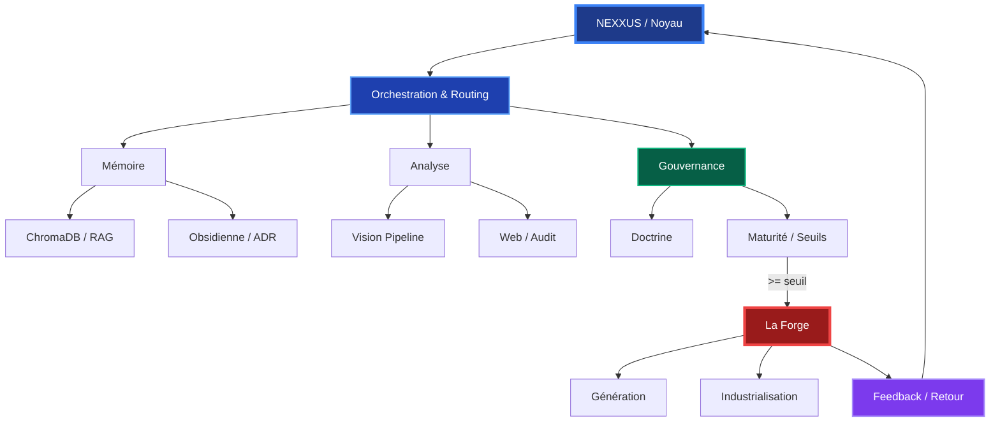

# Manifeste de la Citadelle : Doctrine de Souveraineté & Rigueur Épistémique

## 1. Vision Holistique

La Citadelle est une architecture agentique **souveraine, modulaire et orientée décision**. Son rôle n’est pas de “faire tout”, mais d’orchestrer, analyser, sécuriser, puis préparer la création des livrables quand l'utilisateur en demande.

## 2. Les Piliers de l'Architecture

### 2.1 Le Noyau (Nexxus)

L'orchestrateur central. Il garantit la cohérence globale via un routing intelligent et une doctrine stable. Il ne s'éparpille pas ; il consulte des experts pour chaque décision stratégique.

### 2.2 La Mémoire Patrimoniale

Une structure vivante reliant :

- **Patrimoine** (Archives /projects).
- **Vault Obsidian** (Décisions ADR et Gouvernance).
- **Connaissance Vectorielle** (ChromaDB).
- **Vault graphify**
Elle évite de réinventer l'existant et alimente les arbitrages futurs par le RAG ainsi le système a la possibilité de retrouver ses erreurs afin de ne plus les commettre.

### 2.3 L'Analyse Multimodale

Couche d'analyse disciplinée :

- **Vision Pipeline** : Lecture d'interfaces, résumé de documents importés dans la conversation .

- **Recherche Web** : Signal externe croisé avec le patrimoine interne.

- 

### 2.4 La Gouvernance (Le Point Fort)

Application rigoureuse des règles :

- **Gouvernance** : l'agent orchestrateur hash la requête de l'utilisateur afin de choisir le rail grâce à la détection d'intentions et ce sont les intentions qui permettent de router la requête vers le ou les bons rails
- **Sécurité** : Séparation stricte entre analyse, audit et génération.

- **Transparence Contrôlée** : Savoir quand être opaque ou explicite.

### 2.5 La Discipline Épistémique (v4.5)

Le verrou de la vérité :

- **Observation de Terrain** : Interdiction d'extrapoler des données non vérifiées dans les logs ou le code.
- **Preuve Citée** : Chaque assertion technique doit pointer vers sa source d'observation.
- **Audit de Fiabilité** : Utilisation systématique du CriticAgent pour valider la rigueur des sorties.

## 3. La Forge : L'Atelier d'Exécution

La Citadelle est le **Cerveau** (Réflexion/Arbitrage).
La Forge est la **Main** (Industrialisation/Code).
l' agent OCR est l'**oeil** (Analyse de documents, transcription et traduction
*On ne mélange jamais la réflexion et l'implémentation.*

## 4. Dynamique Contextuelle

L'architecture est évolutive. Elle s'ouvre progressivement selon le contexte et la confiance (Score de Maturité), passant du mode projet à l'ouverture complète des mécanismes internes.

---

**Résumé** : Un système local-first combinant mémoire, analyse et gouvernance pour une préparation optimale à l'industrialisation.
