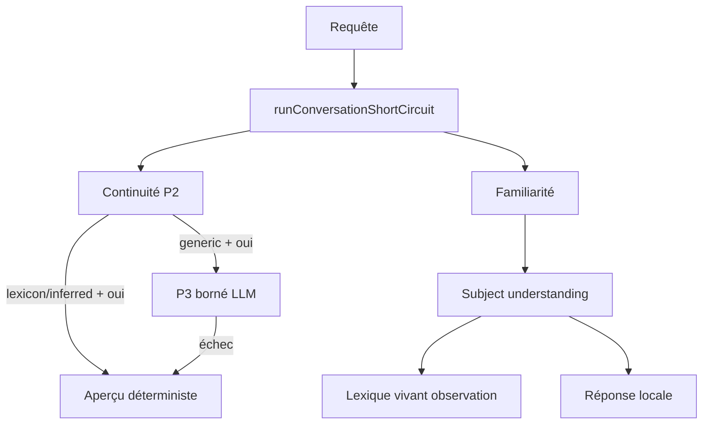

# ADR-20260527 : Stack familiarité en trois temps

## Statut
**Validé** (27/05/2026)

## Contexte

La couche micro P1 ([[ADR-20260601-Micro-Conversation-Delestage]]) a stabilisé le délestage conversationnel (identité, idéation, familiarité). Cependant, la **familiarité** reposait encore implicitement sur :

- un lexique statique (`SUBJECT_LEXICON`) comme **condition de fonctionnement** ;
- un LLM potentiellement sollicité pour « comprendre » des sujets absents du lexique ;
- des follow-ups « oui » fragiles quand aucune définition locale n'existait.

Les correctifs ponctuels (entité principale, `simple_known_subject`, continuité P2, follow-up aperçu) ont prouvé la voie, mais la **doctrine** n'était pas encore figée : *le lexique enrichit, il ne conditionne pas*.

## Décision

Formaliser une **stack familiarité fermée en trois temps**, chaque niveau ayant un **périmètre exclusif** et testé :

| Temps | Rôle | Ce qu'il n'est pas |
|-------|------|-------------------|
| **1 — Subject understanding** | Comprendre intent + sujet + shape | Dépendant du lexique |
| **2 — Lexique vivant** | Accéléler avec preuve gouvernée | Obligatoire au fonctionnement |
| **3 — P3 borné** | Densifier les résidus `generic_topic` | Comprenneur universel |

### Doctrine centrale

> **Compréhension locale d'abord, lexique comme accélérateur, LLM seulement pour densifier les résidus génériques.**

Le LLM n'est plus le « comprenneur universel » : c'est un **compresseur de vagueness** en dernier recours.

---

## Temps 1 — Subject understanding

**Modules** : `micro/classifiers/subjectUnderstanding.js`, guards `familiarityIntentGuards.js`.

| Fonction | Rôle |
|----------|------|
| `detectConversationIntent()` | Intent familiarité / définition / aide |
| `extractCandidateSubject()` | Isolation entité principale |
| `classifyUnknownSubjectShape()` | Shape probable (culturel, sport, lieu, generic…) |
| `resolveKnownOrUnknownSubject()` | Résolution lexique → inférence → fallback |

**Modes de résolution** (`resolutionMode`) :

- `lexicon` — entrée statique ou promue
- `inferred` — shape reconnue, définition générique déterministe
- `generic` — sujet trop vague, candidat P3 si approfondissement

**Fail-closed** : sujet absent du lexique → reconnaissance + aperçu déterministe, pas clarification incohérente.

---

## Temps 2 — Lexique vivant gouverné

**Modules** : `micro/lexicon/*`.

Pipeline :

```
unknownSubjectDetector
  → subjectPromotionCandidateBuilder
  → lexiconPromotionGate
  → promoted-lexicon.json (overlay runtime)
  → learning-events.jsonl (journal)
```

**Doctrine** : pas d'apprentissage opaque. Observation → proposition → promotion selon seuils → preuve traçable.

| Statut | Signification |
|--------|---------------|
| `observed` | Signal insuffisant |
| `proposed` | Candidat en attente (revue humaine si shape à risque) |
| `promoted` | Entrée active dans overlay runtime |
| `rejected` / `revoked` | Refus ou annulation auditable |

**Activation** : `LEXICON_LEARNING=1` (désactivé par défaut).

**Shapes auto-promouvables (faible risque)** : `cultural_event_or_festival`, `sport_or_game`.

**Réversible** : `revokePromotedLexiconEntry(key)`.

---

## Temps 3 — P3 borné (densification résiduelle)

**Modules** : `micro/deepening/boundedSubjectDeepeningPolicy.js`, `boundedSubjectDeepeningSynthesizer.js`.

**Règle** : `SUBJECT_DEEPENING_RULE = generic_topic_deepening_only`.

| `resolutionMode` | Follow-up « oui » | Voie |
|------------------|-------------------|------|
| `lexicon` | Aperçu local précis | Déterministe |
| `inferred` | Aperçu générique shape | Déterministe |
| `generic` | Aperçu enrichi | LLM borné P3 + fallback local |

**Conditions P3** (toutes requises) :

1. Continuité `familiarity_apercu_pending` (P2)
2. Acceptation courte (`oui`, `parle-m'en`, …)
3. `needsBoundedSubjectDeepening(subject) === true`
4. `SUBJECT_DEEPENING_LLM` ≠ `0`

**Modèle** : Granite 8b (`AGENT_ROLES.CHAT`), 60–100 mots, température basse, validation qualité + fallback déterministe si échec.

**Chemin télémétrie** : `subject_deepening_bounded_llm`.

> **Note** : ce P3 familiarité est distinct du « P3 ops » mentionné dans [[ADR-20260601-Micro-Conversation-Delestage]] (télémétrie / health gates).

---

## Flux pipeline consolidé



Ordre `agentPipeline.js` :

1. P3 borné (async, si éligible)
2. Short-circuit sync (social, continuité, idéation, familiarité)
3. Rappel conversationnel Tier 2
4. SIMPLE_FAST / orchestrateur

---

## Principes doctrine — statut

| Principe | Statut |
|----------|--------|
| Local-first | ✅ |
| Fail-closed | ✅ observation, P3, promotion ne cassent jamais la réponse |
| Auditable | ✅ JSONL, provenance, révocation |
| Testable | ✅ 80+ tests familiarité / lexique / P3 |
| LLM parcimonieux | ✅ P3 uniquement sur résidu `generic` |

---

## Conséquences

### Positives

- Comportement prévisible, testable, auditable sur toute la chaîne familiarité
- Lexique extensible sans déploiement code (overlay promu) + voie merge manuelle vers `SUBJECT_LEXICON`
- LLM réduit à un rôle précis et borné

### Compromis

- Double lexique transitoire : statique JS + overlay JSON
- P3 async ajoute une branche pipeline avant short-circuit sync
- Revue humaine encore requise pour shapes `generic_topic` / `person` avant auto-promotion lexique

---

## Validation

```bash
cd server
node --test tests/agent-familiarity-contract.test.js
node --test tests/agent-familiarity-followup.test.js
node --test tests/conversation-continuity-context.test.js
node --test tests/subject-understanding.test.js
node --test tests/lexicon-learning.test.js
node --test tests/subject-deepening-p3.test.js
node --test tests/micro-conversation-shortcircuit.test.js
```

Cas représentatifs :

| Scénario | Attendu |
|----------|---------|
| « Tu connais le carnaval ? » (sans lexique) | Reconnaissance + inférence culturelle |
| « oui » après carnaval | Aperçu déterministe (pas LLM) |
| « Tu connais Zorbulax ? » + « oui » | P3 borné ou fallback local |
| 3× carnaval + `LEXICON_LEARNING=1` | Auto-promotion gouvernée |

---

## Extension

1. **Manuel** : `SUBJECT_LEXICON` + tests (canon long terme)
2. **Gouverné** : observations → promotion overlay (`LEXICON_LEARNING=1`)
3. **P3** : résidu `generic` uniquement — jamais compenser un lexique manquant par prompt LLM élargi

Playbook : [[Playbook-Micro-Delestage-Conversationnel]].

---

## Liens

- [[ADR-20260601-Micro-Conversation-Delestage]]
- [[Micro-Conversation-Delestage]]
- [[ADR-20260601-Memoire-Fil]]
- [[Playbook-Micro-Delestage-Conversationnel]]
- [[Regle-Ancrage-Micro-Outils]]
