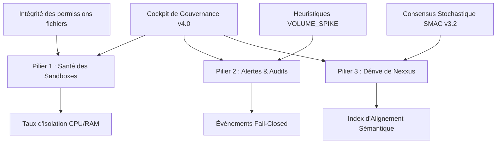

# 🛡️ Spécification : Tableau de Pilotage de Gouvernance Consolidé v4.0

**Statut** : Cadrage Spécifique (Maturité : 0.10 - Spécification Conceptuelle)  
**Date** : 21/05/2026  
**Auteur** : Antigravity, en alignement avec les Directives de Nexxus et de l'Opérateur  

---

## 🎯 1. Vision & Objectifs Stratégiques

Le **Tableau de Pilotage de Gouvernance Consolidé v4.0** (ci-après dénommé *Cockpit de Gouvernance Consolidé*) est l'interface visuelle de contrôle ultime pour La Citadelle. Il a pour but de centraliser en une vue unique et souveraine trois signaux critiques de l'écosystème multi-agents local-first : la santé physique et logique de nos environnements d'exécution, la sévérité des incidents détectés par nos pipelines d'audit, et la dérive comportementale de l'agent orchestrateur **Nexxus**.

Cette console d'observation s'inscrit dans la **Doctrine du Fail-Closed par Défaut** : elle ne vise pas seulement à afficher des indicateurs passifs, mais à fournir les métriques heuristiques nécessaires au déclenchement automatique de modes de secours ou de suspensions défensives d'agents.

---

## 🏛️ 2. Les Trois Piliers Métrologiques

Le tableau de bord fusionne trois flux de données distincts et hautement corrélés :

### 🔋 Pilier 1 : Signal de Santé des Workspaces & Sandboxes
Ce pilier surveille l'intégrité et la confinement des environnements d'exécution (`sandboxes`) au sein desquels s'exécutent les experts IA.
- **Métriques d'Isolation** : Pourcentage d'isolation du processus, état des privilèges en écriture (lecture seule forcée hors-zones de forge).
- **Fuites de Ressources (Leak Detection)** : Suivi en temps réel de la consommation VRAM, CPU, et espace disque des processus d'agent en arrière-plan.
- **Indicateur de Verrouillage (Lock State)** : État d'activation du système de sécurité d'environnement, bloquant l'écriture dans les répertoires sensibles lors de l'exécution de commandes non certifiées.

### 🚨 Pilier 2 : Alertes d'Audit & Fail-Closed
Visualisation en temps réel des flux de sécurité et des décisions heuristiques collectés par les endpoints de [[02-Architecture/modules/Governance-API|l'API de Gouvernance]].
- **Volume des événements `EPISTEMIC_FAIL_CLOSED`** : Graphique temporel des blocages de sécurité provoqués par une incertitude critique ou une violation de règle.
- **Détecteurs de Pic (Spikes)** : 
  - Alerte `VOLUME_SPIKE` : Déclenchée si le volume des blocages épistémiques double sur 24h.
  - Alerte `DOMAIN_SPIKE` : Déclenchée par une multiplication par x3 des blocages sur un domaine spécifique.
- **Niveaux de Sévérité** : Badgeage dynamique (`HIGH`, `CRITICAL`) pour les événements nécessitant une intervention immédiate de l'opérateur ou un basculement en mode dégradé (statique).

### 🧠 Pilier 3 : Indicateurs de Dérive Comportementale de Nexxus
Ce module analytique inédit mesure la dérive sémantique et comportementale de l'orchestrateur central **Nexxus** par rapport aux consignes de sécurité et aux patterns du Knowledge Graph.
- **Index d'Alignement Sémantique (Semantic Alignment Index)** : Mesure vectorielle de la proximité des directives de Nexxus par rapport aux ADRs fondamentaux du Vault. Une dérive vectorielle au-delà d'un angle critique déclenche une alerte de divergence.
- **Consensus Stochastique (SMAC v3.2 Divergence)** : Analyse de la divergence d'opinions des micro-experts lors des phases de consensus. Une trop grande variabilité indique une instabilité décisionnelle.
- **Taux de Complétude & Confiance** : Indicateur synthétique d'assurance de l'agent lors de la résolution de tâches complexes, basé sur les tests de complétude réguliers (`npm run test:completeness`).

---

## 🎨 3. Design Système & Expérience Utilisateur (UI/UX)

Le dashboard hérite de la charte esthétique haut de gamme et stricte de La Citadelle définie dans la spécification du [[02-Architecture/modules/Cockpit-v3-1|Cockpit v3.1]] :
- **Agencement Bento Grid** : Une grille asymétrique et adaptative pour sectoriser clairement les trois piliers métrologiques.
- **Thème "Industrial High-Contrast"** : Fond sombre mat, typographie nette de type monospace pour les logs et sans-serif géométrique pour les statistiques, ratios de contraste WCAG ≥ 4.5:1.
- **Visualisation Dynamique** : Micro-animations d'impulsion sur les graphes temporels (utilisation de Canvas/SVG légers, sans surcharge de HMR).
- **États de Sûreté Visuelle** :
  - `NORMAL` : Éclat discret vert émeraude, rafraîchissement actif.
  - `STALE` : Perte de communication avec les agents de télémétrie (> 7s). Masquage en échelle de gris partiel avec avertissement de liaison interrompue.
  - `ERROR` : Teinte rouge carmin prédominante sur les modules touchés, gel automatique des données pour audit forensique.

---

## 📅 4. Stratégie de Déploiement : Phase d'Observation de 7 Jours

Afin d'éviter toute sur-spécification ou la mise en place de seuils heuristiques trop rigides basés sur des suppositions purement théoriques, l'implémentation physique de ce dashboard est précédée d'une **phase d'observation passive de 7 jours**.

### Protocole de Collecte (Observation passive)
1. **Gel du Socle Technique** : Aucun nouveau module fonctionnel ou modificateur de comportement agentique n'est injecté dans le système runtime pendant cette période.
2. **Journalisation Silencieuse** : Les métriques de santé des sandboxes, les alertes d'audit et les scores vectoriels d'alignement comportemental de Nexxus sont enregistrés en tâche de fond dans les journaux d'audit locaux sans action corrective immédiate.
3. **Analyse de Baseline** : À l'issue des 7 jours, le script d'audit compilera la distribution statistique réelle (médiane, percentiles 95 et 99) pour calibrer précisément :
   - Le bruit de fond normal des blocages épistémiques.
   - Le seuil de déclenchement réel des alertes heuristiques `VOLUME_SPIKE` et `DOMAIN_SPIKE`.
   - La variance acceptable de l'Index d'Alignement Sémantique de Nexxus.

---

## 🧭 5. Directive de Gouvernance : Golden Set Agentique

Le **Golden Set Agentique** constitue la base de vérité pour le routage et la qualité des réponses. Toute nouvelle phrase piège observée doit d'abord être documentée dans ce jeu, puis formalisée comme test de non-régression, avant d'être considérée comme corrigée durablement. La Mémoire des Erreurs complète ce jeu, en capitalisant les cas historiques et en alimentant les prochaines itérations de l'ensemble.

---

## 🔗 6. Liens & Tranches d'Architecture

- [[02-Architecture/modules/Cockpit-v3-1|🛡️ Cockpit de Gouvernance v3.1]] : Référence pour le design système et les hooks de synchronisation.
- [[02-Architecture/modules/Governance-API|🛡️ API de Gouvernance]] : Endpoints de télémétrie et de requêtage brut.
- [[02-Architecture/modules/CGTM-SOEM|⚙️ Cadre de Gouvernance Opérationnelle]] : Architecture globale multi-tenant.

---
*Document rédigé par Antigravity - Conforme à la Taxonomie Souveraine v4.5*
