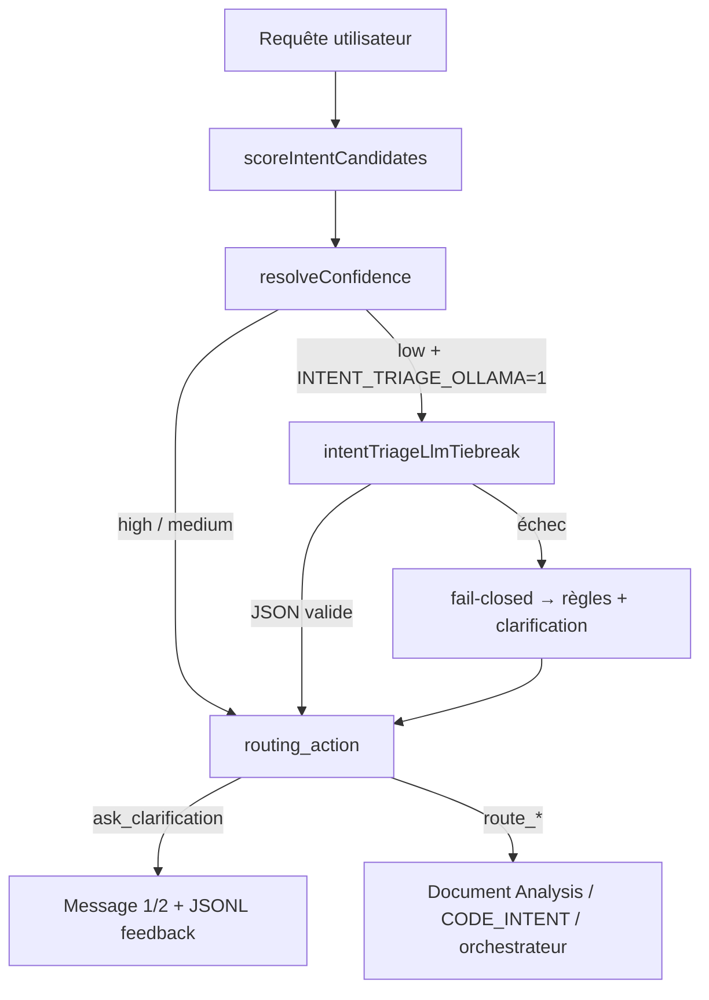

# Module : Intent Triage Classifier (cerveau de tri local)

> **Version** : 1.0.0 | **Date** : 27/05/2026 | **ADR** : [[ADR-20260527-Intent-Triage-Local]]

## Rôle

Couche **local-first** de classification d'intention en **tête de pipeline**, avant Document Analysis et l'orchestrateur LLM.

Objectif : éviter les fuites de routage (ex. revue de code → résumé documentaire) tout en gardant une empreinte faible — règles + scores en priorité, petit modèle Ollama en tie-break optionnel.

## Flux pipeline



## Contrat de sortie (v1)

```json
{
  "top_intent": "code_review",
  "runner_up": "document_analysis",
  "confidence": "high",
  "confidence_score": 0.72,
  "needs_clarification": false,
  "routing_action": "route_direct",
  "score_gap": 0.31,
  "signals": ["executable_snippet", "analyse_plus_snippet"],
  "scores": { "code_review": 0.82, "document_analysis": 0.12 }
}
```

### Intentions (`top_intent` / `runner_up`)

| ID | Label UI | Garde-fou bloquant |
|----|----------|-------------------|
| `code_review` | Revue de code | Oui |
| `code_debug` | Debug | Oui |
| `code_explain` | Explication | Non |
| `code_refactor` | Refactorisation | Non |
| `code_correction` | Correction | Oui |
| `code_audit` | Audit rapide | Oui |
| `code_generation` | Génération | Non |
| `document_analysis` | Analyse documentaire | — |
| `general` | Conversation | — |

### Politique `routing_action`

| Valeur | Condition | Effet |
|--------|-----------|-------|
| `route_direct` | `confidence === high` | Routage immédiat |
| `route_labeled` | `confidence === medium` | Routage + badge SSE intention |
| `ask_clarification` | `needs_clarification` ou ambiguïté | Retour utilisateur 1/2 |

## API publique

| Export | Fichier | Rôle |
|--------|---------|------|
| `triageUserIntent` | `intentTriageClassifier.js` | Tri sync règles+scores |
| `triageUserIntentAsync` | `intentTriageClassifier.js` | Tri + tie-break optionnel |
| `scoreIntentCandidates` | `intentTriageClassifier.js` | Scores bruts (tests / debug) |
| `resolveWantsAnalysisFromTriage` | `intentTriageClassifier.js` | Priorité sur `isDocumentAnalysisIntent` |
| `shouldBlockDocumentAnalysisRoute` | `intentTriageClassifier.js` | Bloque fuite documentaire |
| `buildIntentClarificationMessage` | `intentTriageClassifier.js` | Message clarification 1/2 |
| `applyIntentTriageLlmTiebreak` | `intentTriageLlmTiebreak.js` | Tie-break Ollama |
| `recordIntentTriageClarification` | `intentTriageFeedbackRecorder.js` | Append JSONL |
| `exportIntentTriageGolden` | `intentTriageFeedbackExporter.js` | Export golden CI |

## Signaux de scoring (extraits)

| Signal | Effet |
|--------|-------|
| `code_intent:*` | Bump intention code détectée par `codeIntentPolicy` |
| `executable_snippet` | Favorise `code_review` / `code_debug` |
| `analyse_plus_snippet` | Pénalise `document_analysis` si code présent |
| `explicit_code_review_phrase` | « revue de code », « erreurs bloquantes » |
| `debug_execution_phrase` | « debug », « ne s'exécute pas » + contexte code |
| `document_extractive_verbs` | « résume », « points clés » |
| `llm_tiebreak` | Tie-break Ollama a tranché |

## Configuration

| Variable | Défaut | Description |
|----------|--------|-------------|
| `INTENT_TRIAGE_OLLAMA` | off | `1` = tie-break local activé |
| `OLLAMA_INTENT_TRIAGE_MODEL` | `zephyr` | Modèle Ollama léger |
| `INTENT_TRIAGE_TIMEOUT_MS` | `3500` | Timeout tie-break |
| `INTENT_TRIAGE_FEEDBACK` | on | `0` = pas de JSONL |

## Feedback loop & golden set

1. Clarification pipeline → `server/data/intent-triage/clarification-feedback.jsonl`
2. Analyse patterns : `npm run triage:analyze-ambiguous` (JSON + rapport Vault)
3. Export : `npm run triage:export-golden`
4. CI : `intent-triage-golden.test.js` incrémente `golden-ci-pass-registry.json`
5. Promotion : `npm run triage:promote-golden -- --min-count=5` (ou `--dry-run`)
6. Baseline : `server/tests/fixtures/intentTriageGoldenQueries.js`
7. Auto : `server/tests/fixtures/intentTriageGoldenExported.js`
8. Rapport promotion : `server/data/intent-triage/reports/promoted-cases-YYYY-MM-DD.json`

### Dashboard v1 (cockpit)

| Route UI | `CITADELLE_VIEWS.INTENT_TRIAGE` — sidebar **Opérations → Triage** |
| API | `GET /api/intent-triage/dashboard` · `GET /api/intent-triage/feedback/recent` |

Vue synthèse : KPI clarifications, ambiguïté, tie-break, replay. Vue diagnostic : paires, signaux, recommandations, JSONL récent.

### Analyseur de patterns ambigus

| Commande | Sortie |
|----------|--------|
| `npm run triage:analyze-ambiguous` | JSON `server/data/intent-triage/reports/ambiguous-analysis-YYYY-MM-DD.json` + MD `04-Operations/reports/Rapport-Triage-Ambigu-YYYY-MM-DD.md` |
| `--dry-run` | JSON stdout (sans écriture) |
| `--json-only` | JSON stdout uniquement |

Schéma `intent_triage_ambiguous_v1` : paires `top\|runner_up`, signaux communs, replay règles, recommandations `scoreIntentCandidates`.

## Intégration

Point d'insertion : `agentPipeline.run()` — **avant** `resolveWantsAnalysisFromTriage` et Document Analysis.

Helpers consommés :

- `conversationGuards.isDocumentAnalysisIntent` — garde documentaire
- `codeIntentPolicy.classifyCodeIntent` — taxonomie code
- `codeDeliveryPolicy.isCodeGenerationRequest` — génération vs revue

## Tests de régression

| Suite | Couverture |
|-------|------------|
| `intent-triage-classifier.test.js` | Schéma, calculatrice, résumé, explication |
| `intent-triage-llm-tiebreak.test.js` | Tie-break mock, fail-closed |
| `intent-triage-golden.test.js` | Golden baseline + export feedback |
| `code-review-pipeline-routing.test.js` | Fuite documentaire calculatrice |

## Évolutions prévues (hors v1)

- Buffer streaming UX pour intents `code_*` (éviter affichage avant garde-fou)
- Promotion automatique feedback → baseline après revue humaine
- Embeddings locaux comme signal secondaire (sans remplacer les règles)
