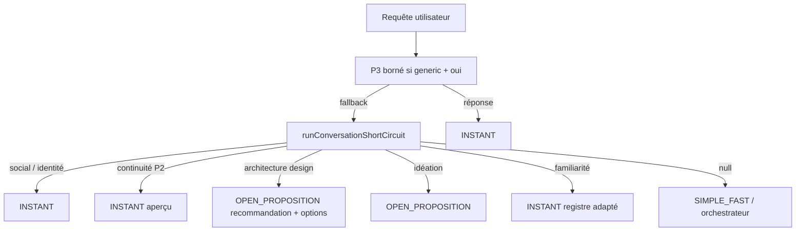

# Module : Micro-automatisations de délestage conversationnel

> **Version** : 1.6.0 | **Date** : 01/06/2026 | **ADR** : [[ADR-20260601-Micro-Conversation-Delestage]] · [[ADR-20260527-Stack-Familiarite-Trois-Temps]] · [[ADR-20260601-Architecture-Design-Options]] · [[ADR-20260601-Conversation-Momentum-P5]]

## Rôle

Couche **local-first** de micro-outils synchrones qui intercepte les requêtes conversationnelles fréquentes **avant** SIMPLE_FAST et l'orchestrateur LLM.

Objectif : **délester la cognition** — le modèle ne raisonne plus sur identité, idéation banale ou « tu connais X ? ».

## Flux pipeline



## Stack familiarité — trois temps

> Doctrine : **compréhension locale d'abord, lexique comme accélérateur, LLM seulement pour densifier les résidus génériques.**

| Temps | Pack | Rôle exclusif |
|-------|------|---------------|
| **1 — Subject understanding** | `classifiers/subjectUnderstanding.js` | Intent + sujet + shape sans lexique |
| **2 — Lexique vivant** | `lexicon/*` | Enrichissement gouverné avec preuve |
| **3 — P3 borné** | `deepening/*` | Densifier `generic_topic` uniquement |

ADR dédiée : [[ADR-20260527-Stack-Familiarite-Trois-Temps]].

### Matrice de routage follow-up « oui »

| `resolutionMode` | Follow-up | Voie |
|------------------|-----------|------|
| `lexicon` | Aperçu précis | Déterministe |
| `inferred` | Aperçu shape (sport, fête…) | Déterministe |
| `generic` | Aperçu enrichi | LLM P3 + fallback local |

Constantes : `SUBJECT_DEEPENING_RULE`, `SUBJECT_DEEPENING_PATH`.

---

## API publique (`server/src/agent/micro/index.js`)

| Export | Pack | Rôle |
|--------|------|------|
| `sanitizeQuery` | normalization | Requête normalisée pour matching |
| `formatSubjectSurfaceForm` | normalization | l'Italie, le Louvre, Michael Jackson… |
| `extractMainEntity` | normalization | Entité principale vs complément |
| `extractCandidateSubject` | classifiers | Candidat sujet normalisé |
| `enrichSubjectResolution` | classifiers | Lexique / inférence / generic |
| `classifySubject` | classifiers | Résolution sujet + catégorie |
| `runConversationShortCircuit` | classifiers | **Entrée pipeline sync** |
| `observeLexiconLearning` | lexicon | Observation sujet inconnu |
| `evaluateBoundedSubjectDeepening` | deepening | Éligibilité P3 |
| `synthesizeBoundedSubjectDeepening` | deepening | Synthèse LLM bornée |
| `buildIdentityReply` | replies | Réponse identité NEXXUS |
| `buildIdeationReply` | replies | 3 pistes / cadrage |
| `buildArchitectureDesignReply` | replies | 3 approches conception (« comment créer X ») |
| `buildFamiliarityReply` | replies | Contact + registre |
| `buildClarificationQuestion` | replies | 1 question de cadrage |

---

## Guards sources (couche métier)

| Fichier | Responsabilité |
|---------|----------------|
| `utils/identityIntentGuards.js` | Identité NEXXUS |
| `utils/ideationIntentGuards.js` | Idéation ouverte |
| `utils/architectureDesignIntentGuards.js` | Conception « comment créer X » → options, pas exécution |
| `utils/skillExecutionClaimGuard.js` | Fail-closed anti-promesse skill-* / orchestrateur |
| `utils/familiarityIntentGuards.js` | Familiarité + lexique statique + overlay promu |
| `utils/familiarityFollowupGuards.js` | Délégation continuité P2 |

---

## Familiarité — taxonomie sujet

### Catégories (`subjectCategory`)

- `tool_platform` — Docker, Obsidian, Teams 365
- `concept_method` — RAG, embeddings
- `place_institution` — lieux, territoires, institutions
- `person_entity` — OpenAI, Mistral, Michael Jackson
- `unknown_subject` — inférence heuristique + registre neutre

### Shapes (`subjectShape`)

- `cultural_event_or_festival`, `sport_or_game`, `place`, `person`, `tool_or_platform`, `concept_or_method`, `generic_topic`

### Sous-types lieu / personne

Voir v1.2 — inchangé (`country_region`, `city_place`, `person_celebrity`, etc.).

### Extraction d'entité principale (`extractMainEntity`)

Quand l'utilisateur formule une familiarité avec **complément**, l'ouverture porte sur l'entité principale uniquement.

Constante : `FAMILIARITY_MAIN_ENTITY_OPENING_RULE = "main_entity_only"`.

### Mode de réponse (`simple_known_subject`)

Reconnaissance brève 1–2 phrases. Constante : `FAMILIARITY_REPLY_MODES.SIMPLE_KNOWN_SUBJECT`.

---

## P2 — Continuité conversationnelle

**Doctrine** : `CONVERSATION_CONTINUITY_RULE = local_thread_state_only`.

| Fonction | Rôle |
|----------|------|
| `readRecentTurns(history, limit=6)` | Fenêtre courte |
| `extractConversationState(turns)` | État structuré du fil |
| `resolveShortFollowup(userText, state)` | Interprète oui / continue / explique |

Chemin : `conversation_continuity_deterministic`.

---

## Lexique vivant gouverné

**Persistance** : `server/data/micro/lexicon/`

| Fichier | Contenu |
|---------|---------|
| `observations.jsonl` | Observations sujets inconnus |
| `proposals.json` | Candidats proposés |
| `promoted-lexicon.json` | Overlay runtime |
| `learning-events.jsonl` | Journal promotions / rejets |
| `rejected.json` | Propositions rejetées |

**Activation** : `LEXICON_LEARNING=1`.

**Auto-promotion** (faible risque) : shapes culturelles et sportives, ≥ 3 occurrences, confiance ≥ 0.72.

**Révocation** : `revokePromotedLexiconEntry(key)`.

Le lexique statique (`SUBJECT_LEXICON`) reste le canon long terme ; l'overlay accélère sans conditionner.

---

## P3 — Densification bornée

**Activation** : activé par défaut ; `SUBJECT_DEEPENING_LLM=0` pour forcer fallback local.

**Modèle** : Granite 8b, prompt 60–100 mots, validation qualité, fallback déterministe.

**Interdit** : utiliser P3 pour compenser un lexique manquant sur sujet classifiable (`inferred`).

---

## P4 — Interprète de requête (`requestInterpreter`)

**Doctrine** : `REQUEST_INTERPRETER_RULE = fragile_reformulate_ambiguous_clarify`

> Nexxus ne corrige pas l'utilisateur ; il stabilise la compréhension des requêtes bancales sans sur-affirmer.

| Brique | Rôle |
|--------|------|
| `requestNormalizer` | Nettoie fillers, reformule formes elliptiques |
| `intentHypothesisBuilder` | 1–2 hypothèses intent + sujet + confiance |
| `ambiguityDetector` | Sujet manquant, référence vague (`ça`), signal faible |
| `clarificationPolicy` | `respond` / `confirm` / `clarify` / `route` |

### Actions

| Confiance | Action | Exemple |
|-----------|--------|---------|
| ≥ 0.78 | `respond` | « et pour noel tu connais ou pas ? » → réponse directe |
| 0.55–0.77 | `confirm` | « truc avec les boules » → « Tu parles de la pétanque ? » |
| bloquant | `clarify` | « et pour ça tu peux me dire ? » → « Tu parles de quel sujet exactement ? » |

**Pipeline** : continuité P2 → interprète P4 → **P5 élan** (architecture) → idéation / familiarité.

### P5 — Élan conversationnel (`momentum/*`)

**Doctrine** : `CONVERSATION_MOMENTUM_RULE = default_recommendation_or_concrete_step`

| Brique | Rôle |
|--------|------|
| `nextMovePolicy` | intent × signal → recommend / clarify / advance |
| `defaultRecommendationBuilder` | Recommandation + prochain pas (ARCHITECTURE_OPTIONS v1) |
| `conversationMomentumOrchestrator` | Applique P5 sans LLM |

ADR : [[ADR-20260601-Conversation-Momentum-P5]].

Chemin télémétrie architecture : `architecture_design_deterministic`. Contrat registry : `ARCHITECTURE_OPTIONS` (priorité 910). Voir [[ADR-20260601-Architecture-Design-Options]].

**Continuité** : phase `subject_confirmation_pending` — « oui » après confirmation enchaîne familiarité.

**Activation** : activé par défaut ; `REQUEST_INTERPRETER=0` pour désactiver.

Chemins télémétrie : `request_interpreter_clarify`, `request_interpreter_confirm`.

Tests : `request-interpreter-p4.test.js`.

---

## Intégration `agentPipeline.js`

Ordre :

1. `evaluateBoundedSubjectDeepening` → `synthesizeBoundedSubjectDeepening` (async)
2. `runConversationShortCircuit` (sync, avec `history`, `sessionId`)
3. Rappel conversationnel Tier 2
4. SIMPLE_FAST / orchestrateur

---

## Tests de non-régression

| Fichier | Couverture |
|---------|------------|
| `micro-conversation-shortcircuit.test.js` | Orchestrateur micro |
| `agent-familiarity-contract.test.js` | Familiarité + registres |
| `agent-familiarity-followup.test.js` | Follow-up aperçu |
| `conversation-continuity-context.test.js` | Continuité P2 |
| `subject-understanding.test.js` | Subject understanding T1 |
| `lexicon-learning.test.js` | Lexique vivant T2 |
| `subject-deepening-p3.test.js` | P3 borné T3 |
| `request-interpreter-p4.test.js` | Interprète requête P4 |
| `architecture-design-intent.test.js` | Conception « comment créer X » |
| `conversation-momentum-p5.test.js` | P5 élan conversationnel |
| `skill-execution-claim-guard.test.js` | Anti-promesse skill runtime |

Suite complète :

```bash
cd server && node --test tests/agent-familiarity-contract.test.js \
  tests/agent-familiarity-followup.test.js \
  tests/conversation-continuity-context.test.js \
  tests/subject-understanding.test.js \
  tests/lexicon-learning.test.js \
  tests/subject-deepening-p3.test.js \
  tests/micro-conversation-shortcircuit.test.js
```

---

## Extension

### Sujet manuel (canon)

1. `CELEBRITY_ALIASES` + `extractMainEntity` si patron complément nouveau
2. `SUBJECT_LEXICON` — label, category, definition
3. `SURFACE_FORM_BY_KEY` si forme surface non triviale
4. Test dans `agent-familiarity-contract.test.js`
5. Mise à jour Vault

### Sujet gouverné (runtime)

1. Activer `LEXICON_LEARNING=1`
2. Laisser le système observer les répétitions
3. Vérifier `learning-events.jsonl` et `proposals.json`
4. Promotions auto (faible risque) ou revue manuelle (generic / person)
5. Merge optionnel vers `SUBJECT_LEXICON` après validation

**Jamais** élargir un prompt LLM pour compenser.

---

## Liens

- [[ADR-20260601-Micro-Conversation-Delestage]]
- [[ADR-20260601-Architecture-Design-Options]]
- [[ADR-20260601-Conversation-Momentum-P5]]
- [[ADR-20260527-Stack-Familiarite-Trois-Temps]]
- [[skill-micro-delestage]]
- [[skill-intent-routing]]
- [[Playbook-Micro-Delestage-Conversationnel]]
