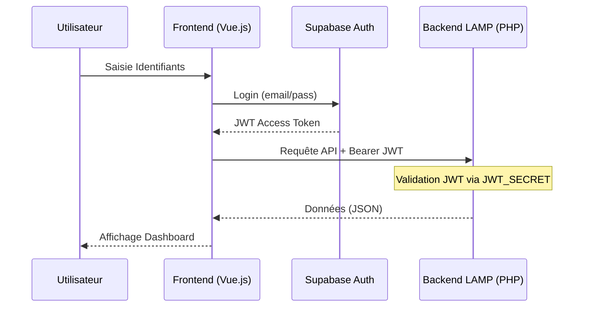

# Architecture : Flux d'Authentification Hybride
> **Projet** : MonCoachScolaire
> **Score SMAC** : 0.96 (🟣 SOTA Validé - [[audit_auth|Consulter l'Audit]])
> **Statut** : Production-Ready
> **Tags** : #moncoach #auth #supabase #smac #forge

## 💡 Stratégie : JWT Bridge
Nous migrons l'identité vers **Supabase Auth** tout en permettant au backend **LAMP (PHP)** de valider les sessions sans base de données partagée, en utilisant la vérification de signature JWT.

## 🛠️ Diagramme de Séquence (Mermaid)

## 📋 Spécifications Techniques
1. **Source de Vérité** : `auth.users` dans Supabase.
2. **Mécanisme** : Le PHP utilise la bibliothèque `firebase/php-jwt` pour décoder le token sans interroger Supabase à chaque requête (gain de latence).
3. **Transition** : Migration progressive des mots de passe MySQL vers Supabase via un script de "Shadow Migration".

## 🛡️ Audit de Sécurité
- **Risque** : Fuite du `JWT_SECRET`.
- **Mitigation** : Stockage dans les variables d'environnement cryptées de la Citadelle (ADR-005).

---
[[../_index|⬅ Retour à l'Index du Projet]]
