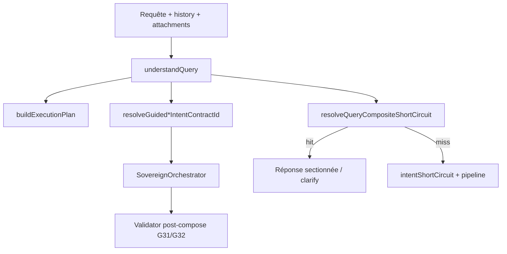

# Module : Query Understanding G29 (+ G30–G32)

> **Version** : 1.0.0 | **Date** : 27/06/2026  
> **ADR** : [[../adr/ADR-20260627-Query-Understanding-G29-v1|ADR Query Understanding G29]]  
> **Spec ops** : `docs/agents/query-understanding-g29-spec.md`

## Rôle

Couche **transversale amont** qui lit une requête avant routage P2 et ConversationMove :

- Segmente les sous-demandes
- Qualifie chaque segment via registre de domaines
- Produit un plan d'exécution et une stratégie globale
- Alimente contrats `GUIDED_*` et télémétrie slots

G28 (math composite) est un **cas particulier** de G29.

## Flux pipeline



## API publique

| Export | Fichier | Rôle |
|--------|---------|------|
| `understandQuery` | `conversationQueryUnderstanding.js` | Lecture multi-segment |
| `buildExecutionPlan` | `conversationQueryUnderstanding.js` | Plan ordonné |
| `resolveQueryCompositeShortCircuit` | `conversationQueryUnderstanding.js` | Composite déterministe |
| `detectDomainIntentInSegment` | `queryUnderstandingDomainRegistry.js` | Qualification segment |
| `runG30CoverageCase` | `queryUnderstandingCoverageMatrix.js` | Régression matrice |

## Intent families instrumentées (juin 2026)

| Famille | Domaine | Contrat | Validator | ADR |
|---------|---------|---------|-----------|-----|
| G31 | `compare_choose` | `GUIDED_PRODUCT_RECOMMENDATION` | `productRecoValidator` | [[../adr/ADR-20260627-Guided-Product-Recommendation-G31-v1\|G31]] |
| G32 | `document_synthesis` | `GUIDED_DOCUMENT_SYNTHESIS` | `documentSynthesisValidator` | [[../adr/ADR-20260627-Guided-Document-Synthesis-G32-v1\|G32]] |

### Playbook (répliquer pour nouveaux domaines)

1. Détecteur registre G29
2. Slots requis → `partial_clarify` si incomplet
3. Stratégie `guided_*` si complet
4. Contrat `intentContractRegistry.js`
5. Validator post-compose
6. Télémétrie : `required_slots`, `missing_slots`, triplet stratégie

## Matrice de couverture G30

**16 cas verts** + **4 gaps** (G30.2, G30.3, G30.5, G30.6)

| Tier | Exemples |
|------|----------|
| L1 | domaine + stratégie |
| L2 | variantes formulation (résumé, synthèse…) |
| L3 | composites cross-domain (doc+datetime) |
| L4 | échecs honnêtes (shell vague, source absente) |

Spec : `docs/agents/query-understanding-g30-coverage-spec.md`

## Télémétrie tour

| Signal | Où |
|--------|-----|
| `pipelineTelemetryCtx.queryUnderstanding` | Slots, domaines, stratégie |
| `pipelineTelemetryCtx.strategyExecution` | declared / effective / override |
| `pipelineTelemetryCtx.intentContractId` | Contrat forcé |
| `productRecoValidation` / `documentSynthesisValidation` | Post-compose |

## Tests de régression

```bash
cd server && node --test \
  tests/query-understanding-g30-coverage.test.js \
  tests/compare-choose-g31-policy.test.js \
  tests/guided-product-recommendation-g31-policy.test.js \
  tests/guided-document-synthesis-g32-policy.test.js \
  tests/document-synthesis-g30-policy.test.js \
  tests/conversation-query-understanding.test.js
```

| Suite | Couverture |
|-------|------------|
| `query-understanding-g30-coverage.test.js` | Matrice 16 verts + 4 skip |
| `compare-choose-g31-policy.test.js` | G31.1/2 + gate |
| `guided-product-recommendation-g31-policy.test.js` | G31.3/4 |
| `guided-document-synthesis-g32-policy.test.js` | G32 complet |
| `document-synthesis-g30-policy.test.js` | G30.1 + composites |

## Backlog

| Ticket | Périmètre |
|--------|-----------|
| G30.2 | Dissertation / rédaction longue |
| G30.3 | Scoping agent IA mobile |
| G30.5 | Composite dissertation + translation |
| G30.6 | Composite webapp + explain |
| G33 | Dissertation guidée (extension G32) |

## Intégration

Point d'insertion : `agentPipeline.run()` — **avant** `runConversationShortCircuit()` et orchestrateur.

`understandQuery` reçoit `attachments` pour slots source G32.
