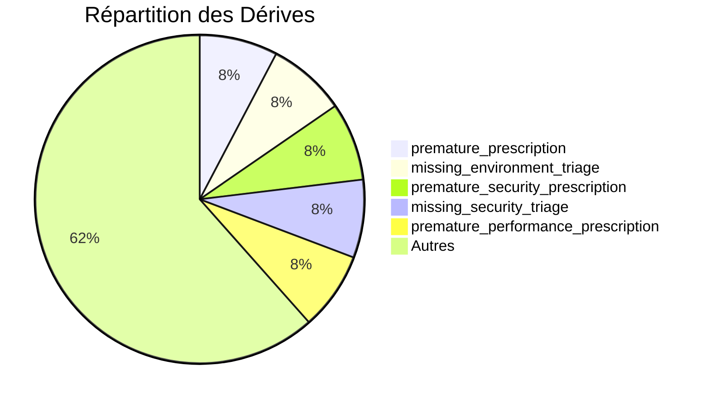

# 🛡️ Cockpit de Gouvernance (Guardrails & Télémétrie)

Ce dashboard consolide l'état des défenses actives du système (ControlHarness) en se basant sur les incidents historisés dans la Mémoire des Erreurs et les remontées de la télémétrie.

---

## 🟢 État des Garde-fous (Guardrails)

*Les métriques ci-dessous sont générées dynamiquement à partir de la [[05-Knowledge/heritage/Memoire-des-Erreurs|Mémoire des Erreurs]].*

<!-- METRICS_START -->
**Total Incidents Scellés** : 7

> [!WARNING] Top Dérives
> 1. **premature_prescription** (1 occurrences)
> 2. **missing_environment_triage** (1 occurrences)
> 3. **premature_security_prescription** (1 occurrences)

### Registre Détaillé

| Motif de Rejet | Occurrences |
|---|---|
| `premature_prescription` | 1 |
| `missing_environment_triage` | 1 |
| `premature_security_prescription` | 1 |
| `missing_security_triage` | 1 |
| `premature_performance_prescription` | 1 |
| `missing_performance_triage` | 1 |
| `premature_code_prescription` | 1 |
| `missing_code_triage` | 1 |
| `pedagogical_overbreadth` | 1 |
| `missing_learning_path` | 1 |
| `intent_misdirection` | 1 |
| `context_breakage` | 1 |
| `progressive_drift` | 1 |

<!-- METRICS_END -->

---

## 📈 Tendances de Routage & Dérives

- **Progressive Drift** : La détection de dérive progressive garantit que l'agent ne glisse pas vers du remplissage générique après une introduction experte.
- **Routage d'Intention** : L'orchestrateur bloque toute tentative de réponse superficielle sur des requêtes nécessitant une revue analytique ou technique approfondie.

## 🔗 Liens Rapides
- [[05-Knowledge/heritage/Memoire-des-Erreurs|📖 Mémoire des Erreurs]]
- [[Bienvenue|🏠 Retour à l'accueil de la Citadelle]]
