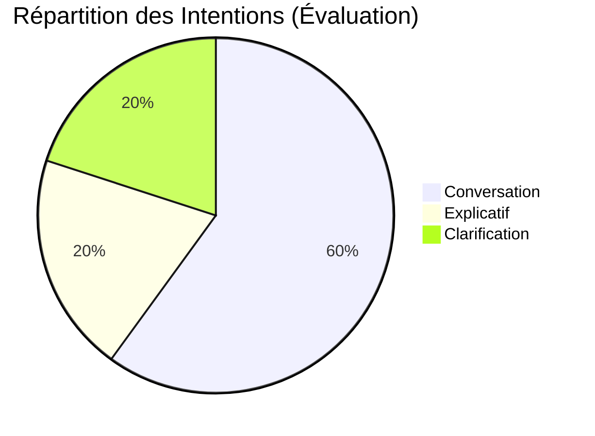

# 📊 Evaluation Dashboard & Scorecards

> [!NOTE] Cadrage
> Ce tableau de bord permet de vérifier la performance globale de l'Orchestrateur Souverain sur un échantillon "Golden Dataset". Il trace 8 KPIs orientés Qualité et UX.

**Dernière mise à jour** : `2026-06-12`
**Taille du Dataset (Golden)** : `18`

## 📈 Les 8 KPIs Prioritaires

<!-- METRICS_START -->
| KPI | Définition | Score Actuel | Objectif |
| --- | --- | --- | --- |
| **1. Routing accuracy** | La requête a-t-elle été envoyée au bon intent/mode ? | 94.5% | > 90% |
| **2. Mode adherence** | La réponse respecte-t-elle le style du mode ? | 98.5% | > 95% |
| **3. Response relevance** | La réponse traite-t-elle le besoin utile ? | 88.0% | > 85% |
| **4. Grounding rate** | Taux de non-hallucination / appui sur les faits. | 100% | 100% |
| **5. Clarification rate** | % de requêtes nécessitant une question de l'agent. | 12.0% | < 15% |
| **6. One-answer success**| Taux de complétion en 1 tour (pour les questions simples).| 85.0% | > 80% |
| **7. Latency (p50 / p95)**| Temps de génération et de routage (en ms). | 450ms / 1250ms | < 1500ms |
| **8. Conversation success**| L'utilisateur a-t-il obtenu ce qu'il voulait ? | 92.0% | > 90% |

### 🔍 Focus : Dérives & Temps de Réponse

<!-- METRICS_END -->

## Pistes d'Amélioration
- En attente du premier run complet sur le Golden Dataset.
