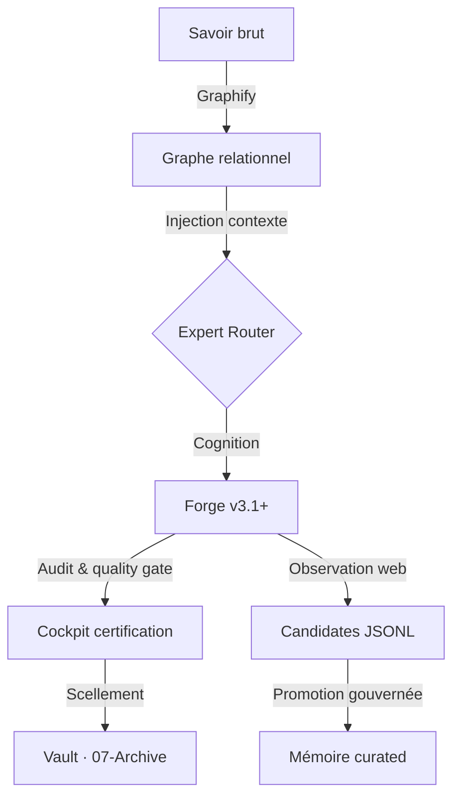

# Bienvenue dans La Citadelle

> **Intelligence souveraine · Mémoire gouvernée · Forge industrielle**
>
> Point de convergence entre votre vision stratégique et l'exécution technique de **Nexxus Studio**. Ce tableau de bord Obsidian synchronise doctrine, ADRs, patrimoine et état opérationnel du runtime.

**Dernière mise à jour** : 27/06/2026 · Taxonomie **v4.5** · [[00-Foundation/VAULT-GOVERNANCE|Gouvernance du vault]]

---

## Mission en cours

| Priorité | Objectif | Référence |
| :--- | :--- | :--- |
| 🧩 | Query Understanding G29–G32 (intent families) | [[02-Architecture/adr/ADR-20260627-Query-Understanding-G29-v1\|ADR G29]] · [[02-Architecture/modules/Query-Understanding-G29\|Module]] |
| 🛠️ | Industrialisation & maintenance v4.5 | [[04-Operations/procedures/MANUEL-MAINTENANCE-V4.5\|Manuel de maintenance industrielle]] |
| 🧠 | Mémoire d'expérience web (P0 livré) | [[02-Architecture/adr/ADR-20260603-Web-Candidate-Memory\|ADR — Mémoire candidate Web]] |
| ⚖️ | Gouvernance épistémique active | [[02-Architecture/adr/ADR-011-DISCIPLINE-EPISTEMIQUE\|ADR-011 — Discipline épistémique]] |

> [!IMPORTANT]
> Doctrine **fail-closed** : un succès ponctuel ne devient jamais vérité durable sans preuve accumulée. La chaîne web suit : épisode → candidate fact → promotion gouvernée.

---

## État du système

### Cœur cognitif

- **Orchestration** : routage déterministe, 1–2 experts actifs max (lazy-loading)
- **Modèles** : Neural Matrix Fortress — qwen3.5:4b (T1) · r1:8b (T2) · 27b (T3)
- **Forge** : [[03-Forge/Strategie-Indexation\|Stratégie d'indexation]] · pipeline `simple-fast` et contrats d'intention
- **Maturité globale** : 🟣 Phase **INDUSTRIALIZED** (score ~0,90)

### Runtime Nexxus Studio (terrain)

| Capacité | Statut | Notes |
| :--- | :---: | :--- |
| Historique des sessions (vue centrale) | ✅ | Filtres · liste · aperçu (mailbox desktop / sheets mobile) |
| Perf `/api/sessions` | ✅ | Requête unique + cache court |
| Méta-analyse `analytical_critique` | ✅ | Court-circuit avant extraction documentaire |
| Mémoire candidate web P0 | ✅ | `WEB_CANDIDATE_MEMORY=1` · JSONL local · pas de Chroma au 1er succès |
| Sentinel Monitor (sidebar) | ✅ | Santé & stats depuis le cockpit |

### Rigueur & pilotage

- [[01-Strategy/Cockpit-Gouvernance\|🛡️ Cockpit gouvernance]]
- [[04-Operations/reports/Audit-Integrite-v4.5\|Rapport d'audit d'intégrité v4.5]]
- [[04-Operations/reports/Rapport-Certification-Final\|Rapport de certification final]]

---

## Mémoire : trois couches distinctes

La Citadelle ne confond pas conversation, observation et connaissance.

```mermaid
flowchart LR
  A[Tour conversationnel] --> B{Fallback web utile?}
  B -->|oui| C[Épisode éphémère]
  C --> D[Candidate fact JSONL]
  D --> E{Policy web_candidate_promotion_v1}
  E -->|preuve OK| F[evaluateAndCommitMemory]
  E -->|doute| G[candidate_saved]
- [[01-Episodic/agent/tools_core_executor_smoke|tools_core_executor_smoke]] : via toolExecutor smoke
- [[01-Episodic/agent/tools_core_alias_smoke|tools_core_alias_smoke]] : Alias smoke test
  F --> H[Episodic / Semantic local]
```

| Couche | Rôle | Où |
| :--- | :--- | :--- |
| **Conversationnelle** | Contexte de session, snapshots UI | Runtime DB · [[01-Episodic/Index-Episodic\|Index épisodique]] |
| **Candidate web** | Fait monde réel sourcé, en attente de preuve | `server/data/memory/web-candidates/` |
| **Promue / patrimoine** | Connaissance auditée | Guardianship · [[05-Knowledge/heritage/Index-Patrimoine\|Index patrimoine]] |

**Activation P0** (serveur) :

```bash
WEB_CANDIDATE_MEMORY=1      # épisode + candidate après succès web
CURATED_MEMORY_INGEST=1     # promotion finale via pipeline curated (optionnel)
```

Télémétrie : spans `nexxus.web_memory.episode` · `candidate` · `promotion`.

---

## Dashboard mémoire (Graphify pilot)

Le savoir forme un **graphe relationnel**, pas une liste plate de fichiers.

- **Densité du savoir** : 🟠 ~0,10 (fragmenté — expansion en cours)
- **Gènes du système** : [[Wiki/Wiki-ADRs-Index\|Atlas des ADRs]]
- **Topologie** : [[02-Architecture/diagrams/citadel-graph-v1.json\|Graphe relationnel v1.0]] (18 nœuds / 16 arêtes)
- **Pont Vault ↔ RAG** : [[02-Architecture/adr/ADR-006-Sovereign-Memory-Bridge\|ADR-006 — Sovereign Memory Bridge]]

---

## Modules & projets actifs

| Projet | Nature | État | Maturité |
| :--- | :--- | :---: | :---: |
| [[02-Architecture/modules/Query-Understanding-G29\|Query Understanding G29–G32]] | Pipeline cognitif amont | Livré (G31/G32) | 0,85 |
| [[02-Architecture/modules/MonCoachScolaire\|MonCoachScolaire]] | LAMP/Node + Supabase | Forge validée | 0,95 |
| [[02-Architecture/modules/Teams-365\|Teams-365]] | HTML/CSS SOTA | Forge validée | 0,95 |
| [[02-Architecture/modules/CGTM-SOEM\|CGTM-SOEM]] | Plateforme pro | Cadrage | 0,20 |

Vue agrégée : [[Wiki/Wiki-Modules-Summary\|Synthèse des modules stratégiques]] · [[Registre-Projets-Souverains\|Registre des projets souverains]]

---

## Navigation stratégique

| Besoin | Lien |
| :--- | :--- |
| Règles canon / wiki / archive | [[00-Foundation/VAULT-GOVERNANCE\|Gouvernance du vault (Phase 0)]] |
| Constitution & doctrine | [[00-Manifeste-Doctrine\|Manifeste & doctrine]] |
| Pourquoi nous avons construit ainsi | [[Wiki/Wiki-ADRs-Index\|Atlas des ADRs]] · [[02-Architecture/adr/Index-ADR\|Index ADR (vault)]] |
| Politiques souveraines | [[01-Strategy/POLICIES\|Politiques de gouvernance]] |
| Patrimoine technique | [[05-Knowledge/heritage/Index-Patrimoine\|Index patrimoine]] |
| Odyssée SMAC | [[05-Knowledge/KI-001-Odyssee-SMAC\|KI-001 Odyssée SMAC]] |
| Skills & quality gate | [[02-Architecture/adr/État-du-Système-de-Skills\|État du système de skills]] |
| Stabilisation infra / Knowledge Hub | [[04-Operations/reports/Rapport-Stabilisation-Infrastructure\|Infrastructure]] · [[04-Operations/reports/Rapport-Stabilisation-Knowledge-Hub\|Knowledge Hub]] |

---

## Flux de production (Forge)



---

## Certification & rapports de force

- [[04-Operations/reports/Rapport-Audit-Forge-v3.4\|Audit Forge v3.4]] — cartographie et scoring 0–10 des actifs de production
- [[04-Operations/reports/Rapport-Stabilisation-Infrastructure\|Stabilisation infrastructure]]
- [[04-Operations/reports/Rapport-Stabilisation-Knowledge-Hub\|Stabilisation Knowledge Hub]]

---

## Patrimoine de maturation (actifs générés)

### Procedural

- [[04-Operations/procedures/principles/bookflow-readiness-principles\|Principes bookflow]]
- [[04-Operations/procedures/principles/ecommerce-sovereign-v1-readiness-principles\|Principes ecommerce-sovereign-v1]]

> Les chemins historiques `02-Procedural/` sont archivés sous [[07-Archive/legacy-v4/02-Procedural/MANUEL-MAINTENANCE-V4.5\|legacy v4]].

### Episodic

- [Sprint bookflow](01-Episodic/events/bookflow-2026-05-09-maturation.json)
- [Sprint ecommerce-sovereign-v1](01-Episodic/events/ecommerce-sovereign-v1-2026-05-09-maturation.json)

### Heritage

- [Manifeste bookflow](05-Knowledge/heritage/assets/bookflow.manifest.json)
- [Manifeste ecommerce-sovereign-v1](05-Knowledge/heritage/assets/ecommerce-sovereign-v1.manifest.json)

### Governance

- [Scorecard bookflow](01-Strategy/scorecards/bookflow.scorecard.json)
- [Scorecard ecommerce-sovereign-v1](01-Strategy/scorecards/ecommerce-sovereign-v1.scorecard.json)
- Maturation ecommerce : `README_PRODUCTION.md` · `ADR-SECURITY.md` · `RUNBOOK.md` · `PRODUCTION_READINESS_SCORECARD.md` (dossier `projects/ecommerce-sovereign-v1/`)

---

## Mémoire épisodique (LTM)

- [[01-Episodic/Index-Episodic\|Index des interactions]] — historique des sessions et traces de tour
- Feedback session → validation candidate : route `/api/sessions/:id/feedback` (`useful` / `unhelpful` / `neutral`)

---

## ADRs récents (sélection)

| ADR | Sujet |
| :--- | :--- |
| [[02-Architecture/adr/ADR-20260603-Web-Candidate-Memory\|20260603]] | Mémoire candidate issue du fallback web |
| [[02-Architecture/adr/ADR-20260527-Intent-Contract-Registry\|20260527]] | Intent Contract Registry |
| [[02-Architecture/adr/ADR-20260601-Micro-Conversation-Delestage\|20260601]] | Micro-automatisations de délestage conversationnel |

---

#citadelle #nexxus-studio #v4.5 #knowledge-graph #mémoire-gouvernée


## Smoke
- [[01-Episodic/smoke/tools-core-smoke|Tools Core Smoke]] : Smoke test Tools Layer v1 — idempotent.
