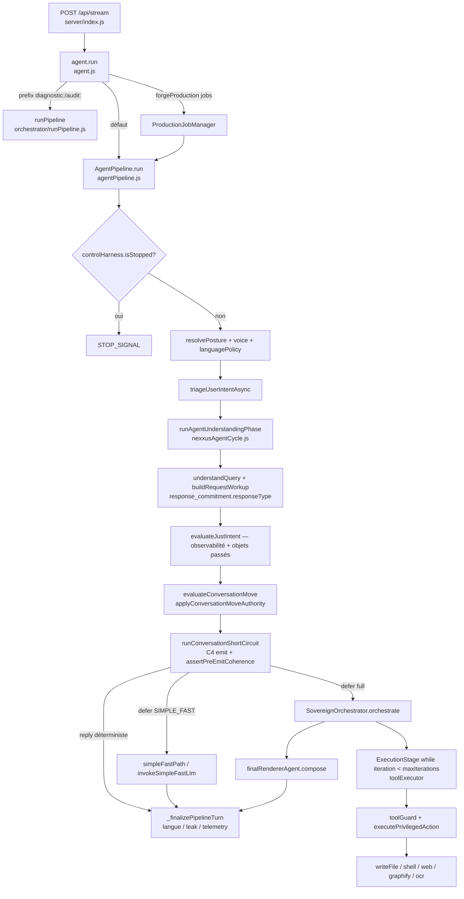

# Architecture La Citadelle — Audit Harness Engineering

- **Date d’audit** : 2026-09-08
- **Branche locale** : `wip/checkpoint-20260824-0117`
- **HEAD** : `4ffc87b2acd478440d045dded9cdcb2d1235aa2c` — `fix(router): prioritize how-to over social and overview for tool procedures` (2026-09-06)
- **Upstream** : aucun (`fatal: no upstream configured for branch`)
- **Remote configuré** : `origin` → `https://github.com/Binwinwinw/nexxustudio.git` (fetch/push observés ; **aucun fetch/pull n’a été exécuté**)
- **État Git synthétique** : working tree **sale** — nombreux fichiers `M` sous `server/src/agent/` (pipeline, SC, policies, langue, how-to, social) et docs cartographie ; nombreux `??` (tests C4 / PRE_EMIT / merge / façade sociale, guard n8n, `docs/ARCHITECTURE_08092026.md`). Le HEAD commité **n’est pas** l’architecture runtime réelle.
- **Périmètre audité** : workspace local `d:\Hostinger\public_html\nexxustudio` (code + docs + tests lus). Runtime chat = `server/src/agent/{agent.js,agentPipeline.js,nexxusAgentCycle.js}` et sous-arbres importés.

**Avertissement.** Cet audit photographie **l’état local**. Le dépôt GitHub public n’a pas d’autorité ici : branche sans tracking, PLAN local « pas de push », working tree largement en avance sur HEAD. Toute comparaison avec GitHub est `NON VÉRIFIÉ` (pas de fetch).

**Statut du présent fichier.** `docs/ARCHITECTURE_08092026.md` existait déjà, **vide**. Ce document **remplace** ce vide par un audit autoportant. Il ne complète pas un texte antérieur.

---

## 1. Périmètre et méthode

### 1.1 Instructions et documents autoritaires lus

| Couche | Chemin | Rôle observé |
|--------|--------|--------------|
| Orientation IDE | `AGENTS.md` | Comportement assistant ; pas le canon runtime |
| Rules Cursor | `.cursor/.cursorrules`, `.cursor/rules/citadelle-input-invariants.mdc`, `review-simplify-verif.mdc`, `ponytail.mdc`, `karpathy-guidelines.mdc`, `tutoiement-francais.mdc` | Aides d’édition ; le mdc input **pointe** le canon, ne le recopie pas |
| Instructions workspace | `.agents/instructions.md` | Doctrine SENTINEL-G + mémoire `.memory/` — **journal secondaire**, pas le canon |
| Canon input | `docs/governance/citadelle-input-invariants.md` | Vérité comportementale amont (1 chaîne, JUST shadow, packet→copie→arrêt) |
| Gouvernance docs | `docs/governance/documentation-source-of-truth.md` | Hiérarchie `docs/` > vault > graphify > `.memory/` > checkpoint |
| Registre lots | `dev/PLAN.md` | Dernière mise à jour **2026-08-31** — **en retard** sur le working tree 2026-09 |
| Architecture générique | `docs/architecture.md` | Principes locaux-first ; **pas** le flux runtime |
| Cartographie | `docs/cartographie/METHODE.md` et cartes lot 0–4, C4, PRE_EMIT, DSH | Photos ; certaines **périmées** vs code (voir §1.3) |
| Vault | `citadelle-vault/Citadelle/01-Architecture/Agent-Memory-Map.md` | Trois mémoires (graphe / vault auto / vault humain) |

`dev/PLAN.md` : lots GO1–GO6 et files HTML/social/calendar/architecture **clos** ; consume JUST **gelé** ; C2-PORT `npm ci` **bloqué** ; candidats audit A–E **non ouverts**. Lots runtime postérieurs au 31/08 (C4.1–C4.2, PRE_EMIT, HOWTO named tool, gate langue COMPOSER) **absents du registre**.

### 1.2 Fichiers et sous-systèmes effectivement inspectés

**Portes :** `server/src/agent/agent.js`, `agentPipeline.js` (`run`, `_finalizePipelineTurn`), `nexxusAgentCycle.js` (`runAgentUnderstandingPhase`).

**Amont :** `policies/conversation/conversationQueryUnderstanding.js` (`buildRequestWorkup`, `resolveResponseType`, `resolveResponseCommitment`), `turnComprehension.js` (via cycle), `micro/classifiers/intentShortCircuit.js` (`runConversationShortCircuit`, `shouldEmitForResponseType`, `assertPreEmitCoherence`, `merge` via policy), `policies/routing/shortCircuitCognitiveCyclePolicy.js`, `conversationMoveAuthority.js`, `justIntentDetectionPolicy.js`, `policies/posture/outputLanguagePolicy.js`.

**Exécution :** `orchestrator/SovereignOrchestrator.js`, `stages/{IntentStage,ExecutionStage}.js`, `orchestrator/BudgetManager.js`, `orchestrator/runPipeline.js` (branche diagnostic), `paths/simpleFastPath.js`, `agents/finalRendererAgent.js` (compose, via pipeline), `utils/runtime/toolExecutor.js`, `harness/toolGuard.js`, `hooks/privilegedActionGate.js`.

**Capacités / Forge :** `capabilities/index.js`, `capabilityToolSession.js`, `graphify/registerTools.js`, `ocr/registerTools.js`, `forge/forgeStageRegistry.js`, `forge/utils/forgeArtifactWriter.js`, `forge/utils/forgeShellRunner.js`, `services/ProductionJobManager.js`.

**Mémoire / observabilité :** `memory/MemoryOrchestrator.js`, `memory/sessionWorkMemory.js`, `audit/auditTrail.js`, `validators/pipelineValidators.js`, `harness/controlHarness.js`, `harness/injectionRadar.js`, `telemetry/turnTelemetry.js` (appels observés).

**Entrée HTTP :** `server/index.js` (`POST /api/stream` → `agent.run`).

**Tests lus ou exécutés :** voir §6 et §7.

### 1.3 Limites

- Pas de fetch GitHub ; écart remote **non mesuré**.
- `agentPipeline.js` ~4600 lignes : flux principal lu par sections, pas ligne à ligne.
- Boucle `ExecutionStage` et handlers Forge : chemins d’entrée et gates lus ; chaque handler de stage **non** ouvert.
- Chroma / Knowledge Hub Docker : chemins cités, **connexion live NON VÉRIFIÉE**.
- `facade-social-via-pipeline.test.js` : lancement dans cet audit **interrompu** (timeout) — assertions non collées ici.
- Cartes `METHODE.md` (C4 « pas de runtime ») et `agent-front-doors.md` (social dans `agent.js`, ~300 LOC) **divergent** du code local 2026-09.

### 1.4 Comptage des statuts (ce document)

| Statut | Nombre |
|--------|--------:|
| Constats **confirmés** dans le code ou un test exécuté | 28 |
| **HYPOTHÈSE** | 9 |
| **NON VÉRIFIÉ** / **À VALIDER** | 11 |

---

## 2. Carte d’autorité

### 2.1 Schéma — entrée → rendu / action



### 2.2 Table d’autorité

| Composant | Responsabilité effective | Entrées lues | Sorties / mutations | Autorité détenue | Preuves |
|-----------|--------------------------|--------------|---------------------|------------------|---------|
| `server/index.js` `/api/stream` | Porte HTTP SSE | `q`, `history`, session, uploads | Stream chunks, `X-Trace-Id` | Transport, pas le job | `server/index.js` ~L1200–1355 |
| `agent.js` `Agent.run` | Façade unique | query, history, options | Délègue pipeline ou `runPipeline` | Branche diagnostic vs chat | `agent.js` L17–107 |
| `nexxusAgentCycle.runAgentUnderstandingPhase` | Compréhension amont | query, history, attachments | `understanding`, `cognitiveCycle`, `turnComprehension`, `turnLoop` | **Quoi** structurel (canon §3) | `nexxusAgentCycle.js` L49–64 |
| `buildRequestWorkup` | Cycle 4 blocs | understanding + options | `response_commitment` (`renderMode`, `responseType`) | **Job + canal** du tour | `conversationQueryUnderstanding.js` L841–888 |
| `evaluateJustIntent` | Classification parallèle | query brute | domaine/action/livrable | **Shadow déclaré** ; objets quand même passés au gate/SC | `justIntentDetectionPolicy.js` L649+ ; `agentPipeline.js` L1192–1225, L1331 |
| `runConversationShortCircuit` | Choix de rail / reply locale | query + options cycle | `{ path, reply?, deferToLlm }` | **Forme et arrêt tôt** si emit autorisé | `intentShortCircuit.js` L780–938 |
| `mergeAgentCycleWithShortCircuit` | Annotation | workup + cycle SC | workup conservé ; SC sous `short_circuit` | **Pas de remplacement** du quoi | `shortCircuitCognitiveCyclePolicy.js` L209–234 ; test merge |
| `SovereignOrchestrator` | Packet experts (aval) | query, history, packet meta | packet, parfois string | Exécution, **pas** re-cadrage amont (doctrine) ; `IntentStage` **reclassifie** | `SovereignOrchestrator.js` en-tête ; `IntentStage.js` L6–32 |
| `finalRendererAgent.compose` | Bouche | packet | texte user | Rendu ; ne doit pas requalifier | `nexxusAgentCycle.js` L6–7 ; cartographie lot 4 |
| `_finalizePipelineTurn` | Filets post-livraison | texte, path, languagePolicy | texte éventuellement remplacé | Langue, leak tardif, telemetry | `agentPipeline.js` ~L4560+ (gate langue) |
| `toolExecutor` + `privilegedActionGate` | Effet de bord outils | action string | FS / réseau / OCR / graphe | Gate **runtime** outils agent et Forge writer | `toolExecutor.js` L74–91 ; `privilegedActionGate.js` L1–4 |
| `ProductionJobManager` | Jobs Forge async | query, session | Map in-memory + `agent.run` | File parallèle au SSE chat | `ProductionJobManager.js` L21–50 |

---

## 3. Cartographie du harness actuel

### A. Entrée et canon

**Observation A1 — Une porte chat, une branche diagnostic.**  
`Agent.run` intercepte `diagnostic:` / `audit:` vers `runPipeline` ; le reste va à `AgentPipeline.run`. Un second early-stop `tryFileAnalysisAwaitingSource` existe **à la fois** dans `agent.js` et au début de `pipeline.run`.  
**Preuve :** `agent.js` L30–48 et L51–97 ; `agentPipeline.js` L876–898.  
**Confiance :** confirmé.  
**Invariant :** une façade `agent.run` ; deux runtimes derrière (chat vs épistémique).  
**Risque :** double awaiting-source (façade + pipeline) — redondance, pas une 2e NLU.

**Observation A2 — Canon unique de compréhension = cycle.**  
`runAgentUnderstandingPhase` enchaîne `understandQuery` → `buildRequestWorkup` → `buildTurnComprehension` → `createTurnLoopState`. Doctrine fichier : Nexxus = une unité ; modules = capacités.  
**Preuve :** `nexxusAgentCycle.js` L9–10, L49–64 ; canon `citadelle-input-invariants.md` invariants 2–3.  
**Confiance :** confirmé (code + canon).

**Observation A3 — Classifications concurrentes, pas un seul score.**  
Sur le même tour, au minimum : `triageUserIntentAsync`, `evaluateJustIntent`, `intentClassifier.classifyIntent` (IntentStage Sovereign), G46 (`conversationTurnClassifier`, logs tests), guards lexicaux SC, `interpretStructuredRequest`. Le canon interdit un **2e NLU consommateur** ; il n’interdit pas l’**observabilité parallèle**.  
**Preuve :** `agentPipeline.js` L1000, L1192 ; `IntentStage.js` L11–12 ; tests C4 logs `[G46]`.  
**Confiance :** confirmé.  
**Risque :** JUST et triage **alimentent** `resolveClarificationGate` (`agentPipeline.js` L1331–1336) — tension avec invariant 6 (JUST shadow). Qualifier « consume » au sens strict = `HYPOTHÈSE` (le gate a d’autres sources : workup, attachments, turnComprehension).

**Observation A4 — Objets d’intention / décision.**  

| Objet | Porteur | Champs d’autorité |
|-------|---------|-------------------|
| Compréhension | `queryUnderstanding` | domains, intents, responseStrategy |
| Cycle | `requestWorkup` / `cognitiveCycle` | `intent_assessment`, `evidence_requirement`, `retrieval_decision`, `action_decision`, `response_commitment` |
| Job reply | `response_commitment.responseType` | `direct` / `clarify` / `overview` / `scoping` — `resolveResponseType` |
| Canal | `response_commitment.renderMode` | `clarify` / `deterministic` / `contractual_llm` / `llm_direct` / `defer_full_pipeline` |
| Pattern / rail | `shortCircuit.path` / `pipelinePath` | forme, pas le job (doctrine C4) |
| Frame | `turnComprehension.entities` | liste fermée subjects/sources/localities/attachments |
| JUST | `justIntent` | domain/action/deliverable — **non autoritaire** d’après canon |

**Preuve :** `conversationQueryUnderstanding.js` L841–888 ; canon invariant 5 ; `c4-response-type-decision.md` §1 (cadrage).  
**Confiance :** confirmé.

**Observation A5 — Divergence doc C4.**  
`docs/cartographie/METHODE.md` (lu 2026-09-08) dit encore C4 « Cadrage ouvert — pas de runtime ». Le code et `pre-emit-coherence.md` décrivent C4.1–C4.2 **runtime**.  
**Statut doc :** `À VALIDER` (carte périmée). **Code :** confirmé (`shouldEmitForResponseType`, tests C4 exécutés).

---

### B. Autorité de décision

**Flux concret (chat, working tree).**

1. HTTP `/api/stream` → `agent.run`.
2. Posture, voix, `resolveOutputLanguagePolicy` (langue **dominante de l’input**, pas encore la cible traduction).
3. Triage async.
4. `runAgentUnderstandingPhase` → workup + `responseType`.
5. JUST évalué ; télémétrie `recordJustIntentTelemetry` ; commentaire P1 shadow (`agentPipeline.js` L1221).
6. `evaluateConversationMove` puis `applyConversationMoveAuthority` : un `earlyTurn` CLARIFY_ONE n’est livré que si `renderMode === "clarify"` (L1371–1392) — **le cycle gagne sur le move**.
7. SC `emit()` : C4.2 bloque un path typé (`*scoping*` / `*_clarify` / `*overview*`) si `responseType` incompatible ; rails non typés (`named_create_start`, `social_deterministic`, `simple_fast`) **passent** le gate typé (`shouldEmitForResponseType` : `implied == null` → true).
8. `assertPreEmitCoherence` : job↔rail, carryover empoisonné, leak interne, refus piste sur sujet concret, gabarit print+n8n.
9. Si reply SC : merge cycle **annote** ; finalize.
10. Sinon SIMPLE_FAST ou Sovereign → compose → finalize.

**Qui possède la décision finale ?**  
- **Quoi / job :** workup (`response_commitment`), confirmé par merge + move.  
- **Arrêt déterministe :** SC si emit OK — **autorité de forme**, bornée par C4/PRE_EMIT/move.  
- **Rendu lourd :** COMPOSER = bouche.  
- **Façade sociale :** `getDeterministicSocialResponse` injecté dans le pipeline ; test dédié présent (exécution `NON VÉRIFIÉ` cet audit). Doctrine lots 1–5 : la façade ne doit pas écraser le workup.

**`mergeAgentCycleWithShortCircuit` :** annotation, **pas** fusion écrasante. Conserve `intent_assessment`, `evidence_requirement`, `retrieval_decision`, `action_decision`, `response_commitment` du `baseCycle` ; pose `short_circuit_authoritative: false`.  
**Preuve :** `shortCircuitCognitiveCyclePolicy.js` L209–234 ; `agentPipeline.js` L2743–2750 ; `server/tests/merge-cycle-honors-workup.test.js` (lu, non relancé jusqu’au bout dans le batch).  
**Confiance :** confirmé.

**`responseType` vs `pattern` vs `renderMode`.**  
C4.2 appliqué **seulement** aux paths dont `inferShortCircuitPathResponseType` retourne une valeur. `renderMode` gouverne le canal (clarify vs deterministic). Un path `named_create_start` peut encore émettre un gabarit print si le texte n’est pas attrapé par PRE_EMIT (cas n8n documenté dans `pre-emit-coherence.md`).  
**Preuve :** `intentShortCircuit.js` L780–814, L921–926 ; tests C4 **exécutés OK** (5+5).  
**Risque confirmé :** double autorité **partielle** — job cycle vs rails non typés.

**Écrasements observés.**  
- Topic shift / entity pivot **reset history** (`agentPipeline.js` L848–861) — peut jeter le contexte avant le workup.  
- `pipelineQuery` réécrit (context ref, continuity) **après** ou autour du cycle — `HYPOTHÈSE` : le workup initial peut diverger de la query envoyée au LLM.  
- Gate langue finalize peut **remplacer** le texte COMPOSER (`enforceOutputLanguage`) — lot langue COMPOSER+web dans le dirty tree ; hors COMPOSER+evidence le blocage reste.

---

### C. Workflow, agent et boucle

**Classification des étapes centrales**

| Étape | Nature |
|-------|--------|
| Posture, langue, awaiting source, SC déterministe, glossaires, math, social local | Déterministe |
| `resolveResponseType`, gates C4/PRE_EMIT/move | Garde |
| `triageUserIntentAsync` (tie-break LLM possible) | Décision LLM **optionnelle** |
| SIMPLE_FAST / COMPOSER | Décision LLM bornée |
| `IntentStage.classifyIntent` | Décision / taxonomie **aval**, parallèle au cycle |
| `ExecutionStage` while + `toolExecutor` | Boucle agent outils |
| Forge `runForgeStages` | Workflow déterministe multi-handlers |
| `_finalizePipelineTurn` | Garde + adaptateur livraison |

**Boucle agent effective (outils).**  
Déclencheur : Sovereign → `ExecutionStage.run` avec `maxIterations` (`agent.js` L7 : **5** ; Sovereign L1304 fallback **3**).  
Contexte : systemPrompt + `recentMemoryBuffer` + history.  
Outils : parse `name(args)` → registry → `toolGuard.validate` → `executePrivilegedAction`.  
Reprise : résultat outil poussé dans `currentHistory`, itération suivante.  
Sortie : pas d’action, ou action déjà dans `executedActions` (`break`), ou `iteration >= maxIterations`.  
Timeout : `BudgetManager` 70s **best-effort, pas d’interruption forcée** (commentaire L5).  
**Preuve :** `ExecutionStage.js` L32–33, L121–128 ; `BudgetManager.js` L1–5, L74–79.

**Ce qui n’est pas une boucle agent.**  
`AgentPipeline.run` est un **pipeline déterministe** (if/return) qui **porte des noms** agentiques (experts, COMPOSER). Le SC n’itère pas. COMPOSER est un appel unique (bufferisé sur DIRECT_EXPLANATION).  
Doctrine `nexxusAgentCycle.js` : un agent logique, capacités internes.

**Retries / fallbacks.**  
- LLM : fallback modèle dans `ExecutionStage` L90–118.  
- SIMPLE_FAST : escalade full pipeline (codes d’erreur observés dans pipeline).  
- Budget : log warn, continue.  
**Risque :** budget non fail-closed (`HYPOTHÈSE` de dépassement silencieux).  
**Risque confirmé :** `maxIterations` 5 vs 3 selon le chemin — deux plafonds.

**Multi-agent ?**  
Plusieurs **modules** (experts web, critic, memory guardian) existent. Une **seconde boucle indépendante avec contexte propre et délégation** n’est **pas** prouvée sur le tour chat : Sovereign orchestre des experts **muets** vers un packet, une bouche. Forge = workflow séquentiel `FORGE_STAGE_DEFINITIONS`.  
**Classification :** mono-agent + pipeline + workflow Forge. Pas un orchestrateur multi-agent au sens harness (plusieurs boucles déléguées).  
`HYPOTHÈSE` : MemoryGuardian/Critic peuvent constituer une sous-boucle hors tour user — non tracée bout en bout.

---

### D. Outils et exécution privilégiée

**Capacités réellement câblées (toolExecutor + packs)**

| Capacité | Point d’effet | Gate observée |
|----------|---------------|---------------|
| Lecture workspace / pulse / scanner | `workspaceScanner`, `pulseEngine`, `projectScanner` | toolGuard + privileged gate (via executeDirect) |
| Écriture fichier agent | `writeFile` + `FileSafety.validatePath` | toolGuard séquence lint + `executePrivilegedAction` |
| Build projet | `projectBuilder.build` | idem |
| Web search / summarize | `searchTool` | idem + SSRF dans gate (`validateEgressUrl` import) |
| Mémoire / heritage | `memoryOrchestrator.getRelevantMemory` | outil |
| Vault | `vaultManager` (switch observé plus bas fichier) | `NON VÉRIFIÉ` détail handler |
| Graphify | `graph_query/path/explain` si `assessGraphifyGraphAvailability` | pack + session turn |
| OCR | `ocr_page`, `ocr_document` → HTTP interne | pack |
| Shell Forge | `forgeShellRunner` | `executePrivilegedAction` |
| Artefacts Forge | `forgeArtifactWriter` | **interdit** `fs.writeFile` direct (commentaire L27) |
| Contrôle arrêt | `controlHarness.requestStop` | halt pipeline |

**Chemin d’autorisation outils agent.**  
`isToolAvailable` → `toolGuard.validate` (allowlist expert + séquence writeFile/validateLint) → `mapToolInvocationToAction` → `executePrivilegedAction` (pre-hooks, audit fail-closed, post-edit).  
**Preuve :** `toolExecutor.js` L69–91 ; `privilegedActionGate.js` L1–4, L13–29 ; `toolGuard.js` L31–55.  
**Enforcement :** runtime, fail-closed **sur ce chemin**. Confirmé.

**Contournements (écritures hors toolExecutor).**  
Confirmés : `sessionWorkMemory.js` `fs.writeFileSync` ; `memoryPromotionService.js` `fs.writeFile` ; `VectorIndex` ; `lexiconLearningStore` ; `pipelineTelemetry.js` ; `candidateFactStore` ; `knowledgeRecordStore` ; `pdfOcrEnrichment` tmp ; `intentTriageGoldenCiRegistry` (CI).  
Ce ne sont **pas** des outils LLM ; ce sont des persisteurs internes.  
**Risque :** plusieurs writers FS **sans** `privilegedActionGate` — gouvernance **décorative** pour ces stores, **réelle** pour outils/Forge artifacts.  
**HYPOTHÈSE :** un handler Forge non passé par `forgeArtifactWriter` écrirait hors gate — non inventorié handler par handler.

**OCR / réseau.**  
`ocr-service` HTTP (vault memory map). Egress web : `networkEgressPolicy.js` / `ssrfProtection.js` importés par la gate.  
Live service **NON VÉRIFIÉ**.

---

### E. État, mémoire et contexte

| Forme | Producteur | Consommateur | Durée | Autorité | Rafraîchissement | Divergence |
|-------|------------|--------------|-------|----------|------------------|------------|
| History HTTP | client `/api/stream` | pipeline, cycle | tour | Client | reset topic/pivot | Client peut mentir |
| `sessionWorkMemory` | `beginSessionWorkTurn` | posture TTL, fichiers vus | fichiers `server/state/session-work-memory/` + Map | Session | prune half-life 30 min | Confirmé dual Map+FS |
| `pipelineTelemetryCtx` | pipeline | merge, finalize | tour | Tour | perdu en fin de requête | Pas une reprise |
| Workup / `response_commitment` | cycle | SC, move, C4 | tour | Canon | non persisté | Perdu si crash |
| JUST / triage | classifiers | UI console, gate | tour | Shadow / mixte | — | Étiquette ≠ rail |
| MemoryOrchestrator | JSON `server/data/memory` | outils knowledge | process | Fichiers + guardian | init au boot | Hors Git souvent |
| VectorIndex / Chroma | index locaux | retrieval | process | Fichiers | `HYPOTHÈSE` sync | Dual retrieval possible |
| Knowledge Hub Docker | compose `docker/knowledge_hub_docker-compose.yml` (ouvert récemment, non lu en détail) | knowledgeService | service | Externe | **NON VÉRIFIÉ** | |
| Vault ADR | humain | docs, pas le runtime chat | durable | `docs/` gagne sur vault pour le comportement | — | Doc vs code (C4) |
| Telemetry JSONL | turnTelemetry | debug | append | Observabilité | — | Pas rejouable comme décision |
| Graphify `graph.json` | CLI update | tools graph_* | régénérable | AST | manuel | Hors vérité métier |
| Git | commits | humains | durable | HEAD ≠ working tree | — | **Écart majeur confirmé** |
| Jobs Forge | ProductionJobManager Map | SSE job | process | RAM | abortController « future » | Perdu au restart (`HYPOTHÈSE`) |

**Réinjection modèle.**  
`ExecutionStage` injecte `recentMemoryBuffer` en message system. SIMPLE_FAST / COMPOSER reçoivent hints (`reflectiveHint`, language addon, capability packs, posture). Continuity peut **réécrire** la query (`buildContinuityKnowledgeQuery` cité PRE_EMIT).  
**Preuve :** `ExecutionStage.js` L53–58 ; `pre-emit-coherence.md` famille B.

**Reprise après crash.**  
Workup **non** persisté. Jobs Forge : Map mémoire — reprise **NON VÉRIFIÉE** au-delà du commentaire « resumable streaming ». Clarification pending : `resumePendingClarification` (fichiers policy) — reprise **conversationnelle** si history conservée, pas si contexte neuf sans history.

---

### F. Lecture parallèle versus écriture centralisée

| Activité | Catégorie | Collision |
|----------|-----------|-----------|
| Experts Sovereign (web, etc.) | lecture / preuves vers packet | Packet unique ensuite — **write in one place** (composer) **si** le chemin compose est unique |
| `onContent` stream COMPOSER | mutation UI avant finalize | PRE_EMIT/langue **après** chunks possibles — **confirmé** comme trou doc PRE_EMIT |
| ProductionJobManager vs `/api/stream` | deux `agent.run` | **HYPOTHÈSE** décisions incompatibles même session |
| `toolGuard.sessionStates` Map | mutation séquence write/lint | Scopé sessionId ; GC 10 min |
| `sessionWorkMemory` Map+FS | mutation | Pas de lock observé |
| Telemetry / health-incidents.jsonl | append concurrent | **HYPOTHÈSE** corruption si multi-process |
| Forge stages séquentiels | workflow | Un `stageResults` ; parallèle **non** dans `runForgeStages` |
| Graphify / OCR | lecture service | Turn-scoped tools (`clearCapabilityToolsForTurn` L839) |

**« Read in parallel, write in one place ».**  
Aligné **pour le texte user du tour chat lourd** : experts muets → packet → compose.  
Non aligné : stream avant filet ; persisteurs FS multiples ; jobs Forge vs chat ; diagnostic `runPipeline` parallèle conceptuel.

**Multi-agent :** non prouvé (voir C).

---

### G. Observabilité, contrats et preuve

| Mécanisme | Rôle | Replay décision ? |
|-----------|------|-------------------|
| `turnTelemetry.startTrace` + `X-Trace-Id` | corrélation HTTP | partiel (métriques, pas le workup complet) |
| Console `[PIPELINE]` / `[G46]` / `[PRE_EMIT]` | debug live | oui pour le rail, non pour le packet |
| `pipelineTelemetryCtx` | tour | perdu en RAM |
| `auditTrail` + `auditRepository` | traces DB | **NON VÉRIFIÉ** si DB up ; fail log si insert rate |
| AJV `pipelineValidators` | packet Sovereign | fail **throw** — fail-closed packet |
| `policy_snapshot` | **NON VÉRIFIÉ** symbole exact dans ce périmètre | — |
| `FEEDBACK_SIGNAL.json` / health-incidents | ops | pas une preuve d’autorité |
| Tests C4, merge, PRE_EMIT, canon, conversation-move | contrat | **preuves de code** |

**Peut-on rejouer entrée → règles → décision → effet ?**  
Partiellement : tests unitaires des gates + logs console. Pas d’artefact unique « decision record » persisté par tour chat (workup n’est pas écrit).  
**HYPOTHÈSE :** un dump télémétrie `server/data/telemetry/agent-*.json` (untracked git status) contient des tours — non ouvert (éviter données session).

---

## 4. Comparaison avec Harness Engineering

Cadre : harness = boucle, outils, contexte, erreurs, gardes, observabilité, persistance, arrêt/reprise, **une autorité d’écriture**.

### Alignements vérifiés

- **Workflow déterministe quand la séquence est connue** : SC, glossaires, math, social local, Forge stages séquentiels, awaiting-source.
- **Agent quand ambigu / outillage** : SIMPLE_FAST, Sovereign+COMPOSER, `ExecutionStage` borné.
- **Une bouche** : doctrine + compose après packet.
- **Gate unique d’effet de bord pour outils LLM et artefacts Forge** : `executePrivilegedAction`.
- **Arrêt d’urgence** : `controlHarness`.
- **Job séparé du pattern** : `responseType` + C4.2 (rails typés).
- **Merge SC n’écrase pas le workup**.
- **Move earlyTurn honore `renderMode`**.
- **Mono-agent déclaré** (`NEXXUS_AGENT_RULE`) plutôt que Cordis/plugin (carte DSH 2026-08-18).

### Complexité justifiée par une contrainte réelle

- Filet SC ordonné : latence / coût LLM (simple → direct).
- Packet experts muets : éviter le dump SERP (lot 4).
- C4/PRE_EMIT : pattern qui volait le job (phpMyAdmin, n8n).
- `FileSafety` + gate : TCB fichiers.
- JUST shadow **visé** : éviter 2e NLU consommatrice (canon).

### Complexité insuffisamment justifiée ou mal bornée

- Reclassification `IntentStage` **après** le cycle (taxonomie `NORMAL_CONVERSATION` vs workup) — collision de langage, pas une 2e bouche, mais **2e décision d’intent**.
- JUST + triage **dans** `resolveClarificationGate` malgré invariant 6.
- `agentPipeline.js` god-orchestrator (~4600 LOC) : une autorité **de fichier**, trop de responsabilités (front-doors lot 0 déjà le notait).
- Budget 70s sans kill.
- Deux plafonds `maxIterations`.
- Stores mémoire/télémétrie hors gate.
- Cartes et `dev/PLAN.md` en retard : **sources de vérité concurrentes pour l’humain**, pas pour le CPU.

### Risques harness (étayés)

1. **Double autorité forme vs job** — rails non typés (named_create, social, simple_fast) ignorent C4.2 ; PRE_EMIT ne couvre qu’une partie. Preuve : `shouldEmitForResponseType` + `pre-emit-coherence.md` §1.
2. **Écriture non centralisée** — stream avant finalize ; FS internes ; jobs async. Preuve : PRE_EMIT famille B ; `sessionWorkMemory` ; `ProductionJobManager`.
3. **Reprise faible** — workup/tour non persistés ; jobs RAM ; history client. Preuve : absence de writer workup ; Map jobs.

Boucle non bornée : **non** établie (`maxIterations` existe).  
Mémoire divergente : **établie** (Git dirty vs HEAD vs PLAN vs cartes C4).

---

## 5. Verdict architectural

**Classification factuelle.**  
Système **mono-agent pipeline** (Citadelle) avec :

- un **harness d’exécution d’outils** (registry + toolGuard + privileged gate + boucle `ExecutionStage`) ;
- un **workflow Forge** séparé (stages + jobs async) ;
- un **contrôle de rail conversationnel** (SC + cycle + C4 partiel + PRE_EMIT) ;

ce n’est **pas** un harness plugin type DeepSeek/Cordis, ni un multi-agent à boucles déléguées indépendantes.

Le working tree 2026-09 **renforce** l’autorité du cycle (merge, C4, move, PRE_EMIT) sans supprimer les classificateurs parallèles ni le god-pipeline.

### Trois risques prioritaires (établis)

1. **Autorité de rail incomplète** : `responseType` ne gouverne pas les rails non typés ; le pattern peut encore livrer (named_create / continuity). Preuve §B + tests C4 (ce qu’ils **ne** bloquent pas).
2. **Filet post-stream** : COMPOSER peut émettre avant langue/leak finalize. Preuve PRE_EMIT + `_finalizePipelineTurn`.
3. **Écart de vérité opérationnelle** : HEAD Git + `dev/PLAN.md` + cartes METHODE ≠ code dirty. Décider sur GitHub ou sur PLAN sans le working tree = fausse photo.

### Trois invariants à préserver

1. **Une chaîne amont** : `understandQuery` + `buildRequestWorkup` ; pas de 2e NLU qui **remplace** le packet (`citadelle-input-invariants.md` 1–4).
2. **Merge SC = annotation** : `short_circuit_authoritative: false` ; le quoi reste le cycle (`mergeAgentCycleWithShortCircuit`).
3. **Mutations outils / artefacts Forge via `executePrivilegedAction`** — fail-closed, pas de `fs.writeFile` agent hors gate (`privilegedActionGate.js`, `forgeArtifactWriter.js`).

---

## 6. Tests et validations à prévoir

Commandes **lecture seule** (aucun migrate/bootstrap/deploy). Exécution dans `server/` :

```text
node --test tests/c4-response-type-governs-emit.test.js
node --test tests/c4-response-type-on-commitment.test.js
node --test tests/citadelle-input-invariants.test.js
node --test tests/merge-cycle-honors-workup.test.js
node --test tests/pre-emit-coherence.test.js
node --test tests/conversation-move-governance.test.js
node --test tests/facade-social-via-pipeline.test.js
```

| Commande / fichier | Statut cet audit | Résultat |
|--------------------|------------------|----------|
| `c4-response-type-governs-emit.test.js` | **Exécuté** | 5/5 OK |
| `c4-response-type-on-commitment.test.js` | **Exécuté** | 5/5 OK |
| `citadelle-input-invariants.test.js` | **Exécuté** | 2/2 OK |
| `merge-cycle-honors-workup.test.js` | Non abouti dans le batch (process stoppé) | Assertions **lues** ; run `NON VÉRIFIÉ` |
| `pre-emit-coherence.test.js` | Logs `[PRE_EMIT] blocked` vus en parallèle ; suite non close | `NON VÉRIFIÉ` total |
| `facade-social-via-pipeline.test.js` | Timeout / hang suspecté | **NON VÉRIFIÉ** |
| `git fetch` / `git pull` | **Non exécuté** (interdit) | — |
| HTTP live `/api/stream` | **Non exécuté** | — |

Ne pas lancer `npm ci`, Forge bootstrap, ni scripts `migrate_*` au titre de cet audit.

---

## 7. Annexe : registre de preuves

### Gouvernance / docs

- `AGENTS.md`
- `.cursor/.cursorrules`
- `.cursor/rules/citadelle-input-invariants.mdc`
- `.agents/instructions.md`
- `docs/governance/citadelle-input-invariants.md`
- `docs/governance/documentation-source-of-truth.md`
- `dev/PLAN.md`
- `docs/architecture.md`
- `docs/cartographie/METHODE.md`
- `docs/cartographie/agent-front-doors.md`
- `docs/cartographie/agent-upstream-decision.md`
- `docs/cartographie/agent-execution-delivery.md`
- `docs/cartographie/c4-response-type-decision.md`
- `docs/cartographie/pre-emit-coherence.md`
- `docs/cartographie/citadelle-vs-deepseek-harness.md`
- `citadelle-vault/Citadelle/01-Architecture/Agent-Memory-Map.md`

### Runtime — symboles

- `Agent.run`, `maxIterations` — `server/src/agent/agent.js`
- `AgentPipeline.run`, `_finalizePipelineTurn`, `evaluateJustIntent` call, `mergeAgentCycleWithShortCircuit` call, `applyConversationMoveAuthority` — `server/src/agent/agentPipeline.js`
- `runAgentUnderstandingPhase`, `NEXXUS_AGENT_RULE`, `NEXXUS_COMPONENT_ROLES` — `server/src/agent/nexxusAgentCycle.js`
- `resolveResponseType`, `resolveResponseCommitment`, `buildRequestWorkup` — `server/src/agent/policies/conversation/conversationQueryUnderstanding.js`
- `mergeAgentCycleWithShortCircuit`, `buildShortCircuitCognitiveContribution` — `server/src/agent/policies/routing/shortCircuitCognitiveCyclePolicy.js`
- `shouldEmitForResponseType`, `assertPreEmitCoherence`, `inferShortCircuitPathResponseType` — `server/src/agent/micro/classifiers/intentShortCircuit.js`
- `applyConversationMoveAuthority` — `server/src/agent/policies/conversation/conversationMoveAuthority.js`
- `evaluateJustIntent` — `server/src/agent/policies/intent/justIntentDetectionPolicy.js`
- `IntentStage.run` — `server/src/agent/stages/IntentStage.js`
- `ExecutionStage.run` — `server/src/agent/stages/ExecutionStage.js`
- `BudgetManager` — `server/src/agent/orchestrator/BudgetManager.js`
- `SovereignOrchestrator` — `server/src/agent/orchestrator/SovereignOrchestrator.js`
- `ToolExecutor.executeDirect` — `server/src/agent/utils/runtime/toolExecutor.js`
- `ToolGuard.validate` — `server/src/agent/harness/toolGuard.js`
- `executePrivilegedAction`, `PRIVILEGED_ACTION_TYPES` — `server/src/hooks/privilegedActionGate.js`
- `composeCapabilityContext` — `server/src/agent/capabilities/index.js`
- `setCapabilityToolsForTurn` — `server/src/agent/capabilities/capabilityToolSession.js`
- `runForgeStages`, `FORGE_STAGE_DEFINITIONS` — `server/src/forge/forgeStageRegistry.js`
- `forgeArtifactWriter` — `server/src/forge/utils/forgeArtifactWriter.js`
- `ProductionJobManager.startJob` — `server/src/services/ProductionJobManager.js`
- `MemoryOrchestrator` — `server/src/agent/memory/MemoryOrchestrator.js`
- `beginSessionWorkTurn` — `server/src/agent/memory/sessionWorkMemory.js`
- `auditTrail` — `server/src/agent/audit/auditTrail.js`
- `validateOrchestratorPacket` — `server/src/agent/validators/pipelineValidators.js`
- `ControlHarness` — `server/src/agent/harness/controlHarness.js`
- `scan` injection — `server/src/agent/harness/injectionRadar.js`
- `enforceOutputLanguage` — `server/src/agent/policies/posture/outputLanguagePolicy.js`
- `POST /api/stream` — `server/index.js`

### Tests

- `server/tests/c4-response-type-governs-emit.test.js` (exécuté)
- `server/tests/c4-response-type-on-commitment.test.js` (exécuté)
- `server/tests/citadelle-input-invariants.test.js` (exécuté)
- `server/tests/merge-cycle-honors-workup.test.js` (lu)
- `server/tests/pre-emit-coherence.test.js`
- `server/tests/facade-social-via-pipeline.test.js`
- `server/tests/conversation-move-governance.test.js`
- `server/tests/conversation-move-contract-verification.test.js`

### Git (lecture seule)

- `git rev-parse`, `git log -1`, `git status -sb`, `git remote -v` — 2026-09-08, sans fetch.

---

AUDIT TERMINÉ — aucune modification fonctionnelle effectuée ; seul docs/ARCHITECTURE_08092026.md a été créé ou mis à jour.
