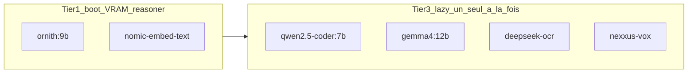

# Stack modèles Ollama — La Citadelle (8 Go VRAM / 64 Go RAM)

Document de référence pour l'audit stack locale. Sources de vérité code :

- `server/src/config/models.js` — tiers boot / lazy
- `server/config/warmup.matrix.json` — warm-up
- `server/src/agent/policies/agentRolePolicy.js` — rôles agents

> **Note** : `docs/PLAN_RECEPTIVITE_MODELES.md` est obsolète (cite `qwen3.5:4b` en Tier 1). La config réelle utilise **`ornith:9b`**.

## Doctrine matérielle

| Ressource | Règle opérationnelle |
|-----------|----------------------|
| **8 Go VRAM** | Un seul modèle dense ~7–9 Go Q4 tient en GPU ; au-delà → offload CPU (latence ×3–10). |
| **64 Go RAM** | Offload hybride **ponctuel** (session Forge, audit) — pas de mono-modèle 20B+ résident. |
| **Tier 3** | Max **1 expert lourd** en VRAM à la fois (vision, OCR, code 7B). |



---

## Tableau 1 — Modèles présents ET utilisés par La Citadelle

| Modèle Ollama | Tier / rôle | Chargement | VRAM décl. | Taille disque | Rôle Citadelle |
|---------------|-------------|------------|------------|---------------|----------------|
| **ornith:9b** | Tier 1 | Boot (résident) | ~7.8 Go | 5.6 Go | CHAT, SOCIAL, reasoner (ORCHESTRATOR, PLANNER, FORGE) |
| **nomic-embed-text:latest** | Tier 1 | Boot | ~0.3 Go | 274 Mo | Embeddings RAG |
| **deepseek-r1:8b** | — | Hors stack | ~5.2 Go | 5.2 Go | Ollama optionnel ; pas warm-up / placement Citadelle |
| **qwen2.5-coder:7b** | Tier 3 | Lazy | ~4.7 Go | 4.7 Go | BUILDER, ELITE_CODER — **seul** coder stack |
| **gemma4:12b** | Tier 3 | Lazy | ~7.6 Go | 7.6 Go | VISION — primaire (llama3.2-vision / mllama cassé Ollama ≥0.30) |
| **deepseek-ocr:latest** | Tier 3 | Lazy | ~6.7 Go | 6.7 Go | OCR — **à conserver** |
| **nexxus-vox:latest** | Tier 3 | Lazy | ~0.5 Go | 531 Mo | VOX voix |

Pas d’alternative coder 14B : `qwen2.5-coder:14b` est **hors stack** (`never` + candidat purge).

### Rôles secondaires (référencés, pas warm-up dédié)

| Modèle | Rôle dans `agentRolePolicy.js` | Statut |
|--------|-------------------------------|--------|
| **qwen3.5:9b** | TRANSLATOR | Installé — fallback Tier 1 `multimodal` / profil `fast` |
| **zephyr:latest** | SEMANTIC_ROUTER | Installé — pas warm-up matrix |

**Total disque stack active** : ~35 Go (hors modèles installés mais non branchés).

---

## Tableau 2 — Autres modèles installés (verdict 8 Go VRAM)

| Modèle | Taille | VRAM Q4 estimée | Verdict 8 Go | Intérêt Citadelle | Recommandation |
|--------|--------|-----------------|--------------|-------------------|----------------|
| zephyr:latest | 4.1 Go | ~4 Go | OK | Routeur sémantique JSON léger | **Garder** |
| smallthinker:3b | 3.6 Go | ~2 Go | OK | Micro-raisonnement | Optionnel |
| qwen2.5-coder:7b | 4.7 Go | ~5 Go | OK | Code généraliste 7B | **Tier 3 coding (seul)** |
| qwen3.5:9b | 6.6 Go | ~7 Go | OK | Chat + traduction | **Fallback Tier 1** (profil B) |
| granite4.1:8b | 5.3 Go | ~5.3 Go | OK | RAG, tools, JSON | Candidat Tier 2 alt. |
| gemma4:12b | 7.6 Go | ~8 Go | Limite | THINKER dense | Test ponctuel seulement |
| qwen2.5-coder:14b | 9.0 Go | ~9–10 Go | Non natif | Ancien fallback Forge | **Hors stack — purger** |
| deepseek-r1:14b | 9.0 Go | ~9–10 Go | Non natif | Tier 2 heavy | Profil `aggressive` + offload |
| llama3.1:latest | 4.9 Go | ~5 Go | OK | Chat legacy | Redondant vs ornith |
| qwen-coder:7b-elite | 6.3 Go | ~6 Go | OK | Ancien elite coder | **Archiver** |
| rnj-1:latest | 5.1 Go | ~5 Go | OK | Niche non mappé | Ignorer |
| QyrouNnet/summarizer:400m | 367 Mo | <1 Go | OK | Résumé léger | Optionnel |
| qwen3-embedding:0.6b | 639 Mo | <1 Go | OK | Embed alternatif | Redondant vs nomic |
| **qwen3-coder:30b** | 18 Go | ~18 Go | Hors GPU | Code expert | **Supprimer disque** |
| **qwen3.6:27b** | 17 Go | ~17 Go | Hors GPU | Dense récent | **Supprimer disque** |
| **qwen3.6:latest** | 23 Go | ~23 Go | Hors GPU | Très lourd | **Supprimer disque** |
| **gemma4:26b** | 17 Go | ~17 Go | Hors GPU | THINKER lourd | **Supprimer disque** |

---

## Purge disque recommandée (~70 Go)

Modèles **hors doctrine 8 Go VRAM** — à supprimer si non utilisés ailleurs :

| Modèle | Taille estimée | Motif |
|--------|----------------|-------|
| `qwen3.6:latest` | ~23 Go | Offload CPU permanent, incompatible Ready-Fast |
| `qwen3.6:27b` | ~17 Go | Idem |
| `gemma4:26b` | ~17 Go | Déjà blacklist `HEAVY_MODELS` |
| `qwen3-coder:30b` | ~18 Go | MoE/dense hors GPU |
| `qwen-coder:7b-elite` | ~6.3 Go | Remplacé par `qwen2.5-coder:7b` |
| `starcoder2:15b` | ~9.1 Go | Remplacé par `qwen2.5-coder:7b` |
| `qwen2.5-coder:14b` | ~9.0 Go | Hors stack — remplacé par `qwen2.5-coder:7b` |

### Vérification avant suppression

```powershell
ollama list
ollama ps
```

### Commandes de purge (manuel — **ne pas automatiser**)

```powershell
ollama stop qwen3.6:latest
ollama rm qwen3.6:latest

ollama stop qwen3.6:27b
ollama rm qwen3.6:27b

ollama stop gemma4:26b
ollama rm gemma4:26b

ollama stop qwen3-coder:30b
ollama rm qwen3-coder:30b

ollama stop qwen-coder:7b-elite
ollama rm qwen-coder:7b-elite

ollama stop qwen2.5-coder:14b
ollama rm qwen2.5-coder:14b
```

Script de listing (sans suppression) :

```bash
node server/scripts/ollama-purge-candidates.mjs
```

---

## Profils de combinaison

### Profil A — Conservateur (stack actuelle)

- Conserver : ornith + nomic + deepseek-r1:8b + qwen2.5-coder:7b + vision + OCR + vox
- Purger les géants listés ci-dessus (+ `starcoder2:15b` si encore présent)
- Règle : max 1 expert Tier 3 lourd en VRAM

### Profil B — Équilibré (config active)

| Slot | Modèle | Fallback config |
|------|--------|-----------------|
| Tier 1 CHAT | `ornith:9b` | `qwen3.5:9b` (profil `fast` + `multimodal`) |
| Tier 2 REASONER | `deepseek-r1:8b` | `deepseek-r1:14b` (profil `aggressive`) |
| Tier 3 CODE | `qwen2.5-coder:7b` | *(aucun — 14b hors stack)* |
| Tier 3 VISION/OCR | inchangé | verrouillés |
| Router | `zephyr` | — |
| Traduction | `qwen3.5:9b` | `agentRolePolicy` TRANSLATOR |

### Profil C — Forge hybride (64 Go RAM)

- Tier 1–2 inchangés ; coder reste `qwen2.5-coder:7b`
- Session reasoner lourde optionnelle : `deepseek-r1:14b` avec offload partiel
- **Jamais** charger un 14B + ornith + vision simultanément

---

## Budget VRAM simultané (8 Go)

| Combinaison | Faisable ? |
|-------------|------------|
| ornith + nomic | Oui (~6 Go) |
| ornith + deepseek-r1:8b | **Non** (~11 Go) — séquentiel |
| qwen2.5-coder:7b seul | Oui (~5 Go) |
| gemma4:12b seul | Oui (~8 Go) |
| deepseek-ocr seul | Oui (~7 Go) |
| qwen3.6:27b (offload CPU) | Lent — session isolée |

---

## Profils boot Ollama

| Variable | Valeur | Effet |
|----------|--------|-------|
| `OLLAMA_BOOT_PROFILE=reactive` | défaut | Tier 1 boot, Tier 2 différé |
| `OLLAMA_BOOT_PROFILE=fast` | | Tier 1 → `qwen3.5:9b` |
| `OLLAMA_BOOT_PROFILE=aggressive` | | Tier 2 primé au boot (~20 s) |

```powershell
# Libérer VRAM avant expert Tier 3
ollama stop ornith:9b
ollama run qwen2.5-coder:7b

# Revenir au chat réactif
ollama stop qwen2.5-coder:7b
```

---

## Validation post-changement

```bash
node --test server/tests/warmup-matrix.test.js server/tests/warmup-cockpit-snapshot.test.js
node server/scripts/smoke-warmup-matrix.mjs
```

Smoke attendu : **15/15 PASS** (cohérence `models.js` ↔ `warmup.matrix.json` ↔ rôles).

---

## Synthèse décisionnelle

| Question | Réponse |
|----------|---------|
| Mono-modèle 27B+ en quotidien ? | **Non** sur 8 Go VRAM |
| Meilleure combinaison ? | Tiering actuel + purge géants + fallback 7B coder si latence Forge |
| Garder vision + OCR ? | **Oui** — Tier 3 lazy |
| Exploiter 64 Go RAM ? | Offload ponctuel 14B Forge, pas résident permanent |
